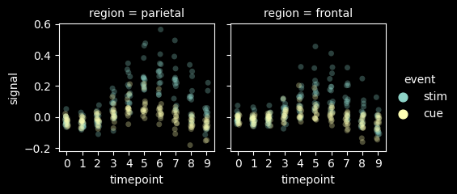
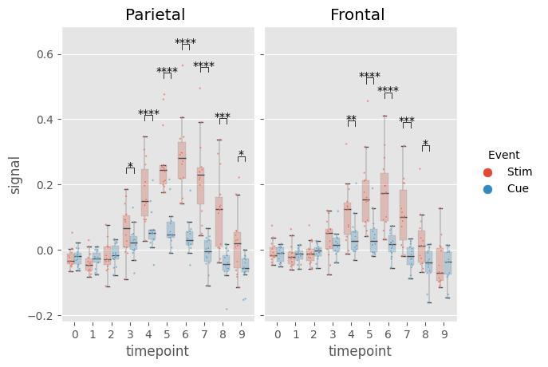

### Import plotastic and example Data


```python
import plotastic as plst

# Import Example Data
DF, _ = plst.load_dataset("fmri", verbose = False)
DF.head()
```

#### Assign each column to a dimension (y, x, hue, col, row)


```python
dims = dict(
    y= 'signal', 
    x= 'timepoint',
    hue= 'event', 
    col= 'region',
)
```

### Initialize DataAnalysis Object
- DataAnalysis will give you feedback on data
- This iobject contains every tool you need, from plotting to statistics!


```python
DA = plst.DataAnalysis(data=DF,           # Dataframe
                       dims=dims,         # Dictionary with y, x, hue, col, row 
                       subject="subject", # Data is paired by subject (optional)
                       )
```

    ================================================================================
    #! checking data integrity...
    ✅ DATA COMPLETE: All combinations of levels from selected factors are present in the Dataframe, including x.
    ✅ GROUPS COMPLETE: No groups with NaNs.
    ✅ GROUPS EQUAL: All groups (40 total) have the same samplesize n = 14.0.
     🌳 LEVELS WELL CONNECTED: These Factors have levels that are always found together: ['region', 'event']. Call .levels_combocount() or .levels_dendrogram() to see them all.
    ✅ Subjects complete: No subjects with missing data
    ================================================================================


#### Quick Preview Plot


```python
DA.catplot(alpha=0.3) # Works with *kwargs of seaborn.catplot()
```


    

    


    <seaborn.axisgrid.FacetGrid at 0x108819f10>


### Perform Statistics

#### Check Normality


```python
DA.check_normality().head(20)
```


<div>
<style scoped>
    .dataframe tbody tr th:only-of-type {
        vertical-align: middle;
    }

    .dataframe tbody tr th {
        vertical-align: top;
    }

    .dataframe thead th {
        text-align: right;
    }
</style>
<table border="1" class="dataframe">
  <thead>
    <tr style="text-align: right;">
      <th></th>
      <th></th>
      <th></th>
      <th>W</th>
      <th>pval</th>
      <th>normal</th>
      <th>n</th>
    </tr>
    <tr>
      <th>region</th>
      <th>event</th>
      <th>timepoint</th>
      <th></th>
      <th></th>
      <th></th>
      <th></th>
    </tr>
  </thead>
  <tbody>
    <tr>
      <th rowspan="20" valign="top">frontal</th>
      <th rowspan="10" valign="top">cue</th>
      <th>0</th>
      <td>0.914917</td>
      <td>0.185710</td>
      <td>True</td>
      <td>14</td>
    </tr>
    <tr>
      <th>6</th>
      <td>0.974828</td>
      <td>0.933696</td>
      <td>True</td>
      <td>14</td>
    </tr>
    <tr>
      <th>3</th>
      <td>0.932624</td>
      <td>0.331983</td>
      <td>True</td>
      <td>14</td>
    </tr>
    <tr>
      <th>5</th>
      <td>0.869613</td>
      <td>0.041439</td>
      <td>False</td>
      <td>14</td>
    </tr>
    <tr>
      <th>7</th>
      <td>0.965730</td>
      <td>0.814991</td>
      <td>True</td>
      <td>14</td>
    </tr>
    <tr>
      <th>1</th>
      <td>0.953819</td>
      <td>0.621403</td>
      <td>True</td>
      <td>14</td>
    </tr>
    <tr>
      <th>4</th>
      <td>0.853934</td>
      <td>0.025128</td>
      <td>False</td>
      <td>14</td>
    </tr>
    <tr>
      <th>2</th>
      <td>0.959380</td>
      <td>0.712867</td>
      <td>True</td>
      <td>14</td>
    </tr>
    <tr>
      <th>8</th>
      <td>0.912661</td>
      <td>0.172244</td>
      <td>True</td>
      <td>14</td>
    </tr>
    <tr>
      <th>9</th>
      <td>0.907248</td>
      <td>0.143726</td>
      <td>True</td>
      <td>14</td>
    </tr>
    <tr>
      <th rowspan="10" valign="top">stim</th>
      <th>0</th>
      <td>0.898415</td>
      <td>0.106968</td>
      <td>True</td>
      <td>14</td>
    </tr>
    <tr>
      <th>6</th>
      <td>0.939964</td>
      <td>0.417863</td>
      <td>True</td>
      <td>14</td>
    </tr>
    <tr>
      <th>4</th>
      <td>0.945087</td>
      <td>0.487335</td>
      <td>True</td>
      <td>14</td>
    </tr>
    <tr>
      <th>1</th>
      <td>0.909201</td>
      <td>0.153429</td>
      <td>True</td>
      <td>14</td>
    </tr>
    <tr>
      <th>2</th>
      <td>0.943336</td>
      <td>0.462730</td>
      <td>True</td>
      <td>14</td>
    </tr>
    <tr>
      <th>3</th>
      <td>0.962568</td>
      <td>0.765064</td>
      <td>True</td>
      <td>14</td>
    </tr>
    <tr>
      <th>9</th>
      <td>0.869722</td>
      <td>0.041585</td>
      <td>False</td>
      <td>14</td>
    </tr>
    <tr>
      <th>5</th>
      <td>0.897018</td>
      <td>0.102095</td>
      <td>True</td>
      <td>14</td>
    </tr>
    <tr>
      <th>7</th>
      <td>0.940434</td>
      <td>0.423909</td>
      <td>True</td>
      <td>14</td>
    </tr>
    <tr>
      <th>8</th>
      <td>0.876136</td>
      <td>0.051214</td>
      <td>True</td>
      <td>14</td>
    </tr>
  </tbody>
</table>
</div>


#### Check Sphericity


```python
DA.check_sphericity()
```


<div>
<style scoped>
    .dataframe tbody tr th:only-of-type {
        vertical-align: middle;
    }

    .dataframe tbody tr th {
        vertical-align: top;
    }

    .dataframe thead th {
        text-align: right;
    }
</style>
<table border="1" class="dataframe">
  <thead>
    <tr style="text-align: right;">
      <th></th>
      <th></th>
      <th></th>
      <th>spher</th>
      <th>W</th>
      <th>chi2</th>
      <th>dof</th>
      <th>pval</th>
      <th>group count</th>
      <th>n per group</th>
    </tr>
    <tr>
      <th>region</th>
      <th>event</th>
      <th>timepoint</th>
      <th></th>
      <th></th>
      <th></th>
      <th></th>
      <th></th>
      <th></th>
      <th></th>
    </tr>
  </thead>
  <tbody>
    <tr>
      <th rowspan="2" valign="top">frontal</th>
      <th>cue</th>
      <th>0</th>
      <td>True</td>
      <td>3.260856e+20</td>
      <td>-462.715239</td>
      <td>44</td>
      <td>1.0</td>
      <td>10</td>
      <td>[14, 14, 14, 14, 14, 14, 14, 14, 14, 14]</td>
    </tr>
    <tr>
      <th>stim</th>
      <th>0</th>
      <td>True</td>
      <td>2.456616e+17</td>
      <td>-392.270460</td>
      <td>44</td>
      <td>1.0</td>
      <td>10</td>
      <td>[14, 14, 14, 14, 14, 14, 14, 14, 14, 14]</td>
    </tr>
    <tr>
      <th rowspan="2" valign="top">parietal</th>
      <th>cue</th>
      <th>0</th>
      <td>True</td>
      <td>1.202935e+20</td>
      <td>-452.946123</td>
      <td>44</td>
      <td>1.0</td>
      <td>10</td>
      <td>[14, 14, 14, 14, 14, 14, 14, 14, 14, 14]</td>
    </tr>
    <tr>
      <th>stim</th>
      <th>0</th>
      <td>True</td>
      <td>2.443175e+13</td>
      <td>-301.989490</td>
      <td>44</td>
      <td>1.0</td>
      <td>10</td>
      <td>[14, 14, 14, 14, 14, 14, 14, 14, 14, 14]</td>
    </tr>
  </tbody>
</table>
</div>


#### Repeated Measures ANOVA


```python
DA.omnibus_rm_anova()
```


<div>
<style scoped>
    .dataframe tbody tr th:only-of-type {
        vertical-align: middle;
    }

    .dataframe tbody tr th {
        vertical-align: top;
    }

    .dataframe thead th {
        text-align: right;
    }
</style>
<table border="1" class="dataframe">
  <thead>
    <tr style="text-align: right;">
      <th></th>
      <th></th>
      <th>Source</th>
      <th>SS</th>
      <th>ddof1</th>
      <th>ddof2</th>
      <th>MS</th>
      <th>F</th>
      <th>p-unc</th>
      <th>stars</th>
      <th>p-GG-corr</th>
      <th>ng2</th>
      <th>eps</th>
    </tr>
    <tr>
      <th>region</th>
      <th></th>
      <th></th>
      <th></th>
      <th></th>
      <th></th>
      <th></th>
      <th></th>
      <th></th>
      <th></th>
      <th></th>
      <th></th>
      <th></th>
    </tr>
  </thead>
  <tbody>
    <tr>
      <th rowspan="3" valign="top">parietal</th>
      <th>0</th>
      <td>timepoint</td>
      <td>1.583420</td>
      <td>9</td>
      <td>117</td>
      <td>0.175936</td>
      <td>26.205536</td>
      <td>3.402866e-24</td>
      <td>****</td>
      <td>5.834631e-07</td>
      <td>0.542320</td>
      <td>0.222299</td>
    </tr>
    <tr>
      <th>1</th>
      <td>event</td>
      <td>0.770449</td>
      <td>1</td>
      <td>13</td>
      <td>0.770449</td>
      <td>85.316794</td>
      <td>4.483881e-07</td>
      <td>****</td>
      <td>4.483881e-07</td>
      <td>0.365706</td>
      <td>1.000000</td>
    </tr>
    <tr>
      <th>2</th>
      <td>timepoint * event</td>
      <td>0.623532</td>
      <td>9</td>
      <td>117</td>
      <td>0.069281</td>
      <td>29.541730</td>
      <td>3.262477e-26</td>
      <td>****</td>
      <td>3.521208e-06</td>
      <td>0.318157</td>
      <td>0.171882</td>
    </tr>
    <tr>
      <th rowspan="3" valign="top">frontal</th>
      <th>0</th>
      <td>timepoint</td>
      <td>0.686264</td>
      <td>9</td>
      <td>117</td>
      <td>0.076252</td>
      <td>15.988779</td>
      <td>8.285677e-17</td>
      <td>****</td>
      <td>8.940660e-05</td>
      <td>0.394411</td>
      <td>0.190812</td>
    </tr>
    <tr>
      <th>1</th>
      <td>event</td>
      <td>0.240461</td>
      <td>1</td>
      <td>13</td>
      <td>0.240461</td>
      <td>23.441963</td>
      <td>3.218963e-04</td>
      <td>***</td>
      <td>3.218963e-04</td>
      <td>0.185803</td>
      <td>1.000000</td>
    </tr>
    <tr>
      <th>2</th>
      <td>timepoint * event</td>
      <td>0.242941</td>
      <td>9</td>
      <td>117</td>
      <td>0.026993</td>
      <td>13.031063</td>
      <td>3.235739e-14</td>
      <td>****</td>
      <td>1.566020e-04</td>
      <td>0.187360</td>
      <td>0.213142</td>
    </tr>
  </tbody>
</table>
</div>


#### Post-hoc t-tests


```python
DA.test_pairwise()
```


<div>
<style scoped>
    .dataframe tbody tr th:only-of-type {
        vertical-align: middle;
    }

    .dataframe tbody tr th {
        vertical-align: top;
    }

    .dataframe thead th {
        text-align: right;
    }
</style>
<table border="1" class="dataframe">
  <thead>
    <tr style="text-align: right;">
      <th></th>
      <th></th>
      <th></th>
      <th>timepoint</th>
      <th>A</th>
      <th>B</th>
      <th>mean(A)</th>
      <th>std(A)</th>
      <th>mean(B)</th>
      <th>std(B)</th>
      <th>Paired</th>
      <th>Parametric</th>
      <th>T</th>
      <th>dof</th>
      <th>alternative</th>
      <th>p-unc</th>
      <th>BF10</th>
      <th>hedges</th>
      <th>**p-unc</th>
      <th>Sign.</th>
      <th>pairs</th>
      <th>cross</th>
    </tr>
    <tr>
      <th>region</th>
      <th>event</th>
      <th>Contrast</th>
      <th></th>
      <th></th>
      <th></th>
      <th></th>
      <th></th>
      <th></th>
      <th></th>
      <th></th>
      <th></th>
      <th></th>
      <th></th>
      <th></th>
      <th></th>
      <th></th>
      <th></th>
      <th></th>
      <th></th>
      <th></th>
      <th></th>
    </tr>
  </thead>
  <tbody>
    <tr>
      <th rowspan="5" valign="top">parietal</th>
      <th rowspan="5" valign="top">-</th>
      <th>timepoint</th>
      <td>-</td>
      <td>0</td>
      <td>1</td>
      <td>-0.024080</td>
      <td>0.019279</td>
      <td>-0.034378</td>
      <td>0.020787</td>
      <td>True</td>
      <td>True</td>
      <td>4.289549</td>
      <td>13.0</td>
      <td>two-sided</td>
      <td>0.000880</td>
      <td>43.681</td>
      <td>0.498734</td>
      <td>***</td>
      <td>signif.</td>
      <td>(0, 1)</td>
      <td>x</td>
    </tr>
    <tr>
      <th>timepoint</th>
      <td>-</td>
      <td>0</td>
      <td>2</td>
      <td>-0.024080</td>
      <td>0.019279</td>
      <td>-0.017773</td>
      <td>0.032772</td>
      <td>True</td>
      <td>True</td>
      <td>-0.755546</td>
      <td>13.0</td>
      <td>two-sided</td>
      <td>0.463392</td>
      <td>0.346</td>
      <td>-0.227782</td>
      <td>ns</td>
      <td>False</td>
      <td>(0, 2)</td>
      <td>x</td>
    </tr>
    <tr>
      <th>timepoint</th>
      <td>-</td>
      <td>0</td>
      <td>3</td>
      <td>-0.024080</td>
      <td>0.019279</td>
      <td>0.041580</td>
      <td>0.056211</td>
      <td>True</td>
      <td>True</td>
      <td>-4.031294</td>
      <td>13.0</td>
      <td>two-sided</td>
      <td>0.001426</td>
      <td>28.944</td>
      <td>-1.517100</td>
      <td>**</td>
      <td>signif.</td>
      <td>(0, 3)</td>
      <td>x</td>
    </tr>
    <tr>
      <th>timepoint</th>
      <td>-</td>
      <td>0</td>
      <td>4</td>
      <td>-0.024080</td>
      <td>0.019279</td>
      <td>0.119216</td>
      <td>0.072481</td>
      <td>True</td>
      <td>True</td>
      <td>-6.565685</td>
      <td>13.0</td>
      <td>two-sided</td>
      <td>0.000018</td>
      <td>1298.443</td>
      <td>-2.623299</td>
      <td>****</td>
      <td>signif.</td>
      <td>(0, 4)</td>
      <td>x</td>
    </tr>
    <tr>
      <th>timepoint</th>
      <td>-</td>
      <td>0</td>
      <td>5</td>
      <td>-0.024080</td>
      <td>0.019279</td>
      <td>0.168279</td>
      <td>0.076726</td>
      <td>True</td>
      <td>True</td>
      <td>-8.059735</td>
      <td>13.0</td>
      <td>two-sided</td>
      <td>0.000002</td>
      <td>9016.247</td>
      <td>-3.338521</td>
      <td>****</td>
      <td>signif.</td>
      <td>(0, 5)</td>
      <td>x</td>
    </tr>
    <tr>
      <th>...</th>
      <th>...</th>
      <th>...</th>
      <td>...</td>
      <td>...</td>
      <td>...</td>
      <td>...</td>
      <td>...</td>
      <td>...</td>
      <td>...</td>
      <td>...</td>
      <td>...</td>
      <td>...</td>
      <td>...</td>
      <td>...</td>
      <td>...</td>
      <td>...</td>
      <td>...</td>
      <td>...</td>
      <td>...</td>
      <td>...</td>
      <td>...</td>
    </tr>
    <tr>
      <th rowspan="5" valign="top">frontal</th>
      <th rowspan="5" valign="top">stim</th>
      <th>event * timepoint</th>
      <td>NaN</td>
      <td>6</td>
      <td>8</td>
      <td>0.171782</td>
      <td>0.113811</td>
      <td>0.024913</td>
      <td>0.083956</td>
      <td>True</td>
      <td>True</td>
      <td>5.202021</td>
      <td>13.0</td>
      <td>two-sided</td>
      <td>0.000170</td>
      <td>180.476</td>
      <td>1.425848</td>
      <td>***</td>
      <td>signif.</td>
      <td>((8, stim), (6, stim))</td>
      <td>x</td>
    </tr>
    <tr>
      <th>event * timepoint</th>
      <td>NaN</td>
      <td>6</td>
      <td>9</td>
      <td>0.171782</td>
      <td>0.113811</td>
      <td>-0.042044</td>
      <td>0.070980</td>
      <td>True</td>
      <td>True</td>
      <td>5.978460</td>
      <td>13.0</td>
      <td>two-sided</td>
      <td>0.000046</td>
      <td>568.484</td>
      <td>2.188817</td>
      <td>****</td>
      <td>signif.</td>
      <td>((9, stim), (6, stim))</td>
      <td>x</td>
    </tr>
    <tr>
      <th>event * timepoint</th>
      <td>NaN</td>
      <td>7</td>
      <td>8</td>
      <td>0.109996</td>
      <td>0.098997</td>
      <td>0.024913</td>
      <td>0.083956</td>
      <td>True</td>
      <td>True</td>
      <td>5.899680</td>
      <td>13.0</td>
      <td>two-sided</td>
      <td>0.000052</td>
      <td>507.441</td>
      <td>0.899980</td>
      <td>****</td>
      <td>signif.</td>
      <td>((8, stim), (7, stim))</td>
      <td>x</td>
    </tr>
    <tr>
      <th>event * timepoint</th>
      <td>NaN</td>
      <td>7</td>
      <td>9</td>
      <td>0.109996</td>
      <td>0.098997</td>
      <td>-0.042044</td>
      <td>0.070980</td>
      <td>True</td>
      <td>True</td>
      <td>6.295658</td>
      <td>13.0</td>
      <td>two-sided</td>
      <td>0.000028</td>
      <td>892.198</td>
      <td>1.713727</td>
      <td>****</td>
      <td>signif.</td>
      <td>((9, stim), (7, stim))</td>
      <td>x</td>
    </tr>
    <tr>
      <th>event * timepoint</th>
      <td>NaN</td>
      <td>8</td>
      <td>9</td>
      <td>0.024913</td>
      <td>0.083956</td>
      <td>-0.042044</td>
      <td>0.070980</td>
      <td>True</td>
      <td>True</td>
      <td>6.073903</td>
      <td>13.0</td>
      <td>two-sided</td>
      <td>0.000039</td>
      <td>651.786</td>
      <td>0.836222</td>
      <td>****</td>
      <td>signif.</td>
      <td>((9, stim), (8, stim))</td>
      <td>x</td>
    </tr>
  </tbody>
</table>
<p>292 rows × 19 columns</p>
</div>


#### Save Results
Output is one excel file containing results of all performed tests (normality, anova,
t-tests, etc.) in different sheets


```python
DA.save_statistics("example.xlsx")
```

### Make a Pretty Plot with Statistical Annotations in Few Lines!


#### Use matplotlib styles (optional)


```python
from matplotlib import pyplot as plt
plt.rcdefaults()        # Reset rc to default
plt.style.use('ggplot') # Set styles as you're used to'
```

#### Chain multiple commands for plotting:


```python
(DA
 .plot_box_strip()   # Use a pre-built plotting function to initialize and draw the plot
 .annotate_pairwise( # Place results calculated previously (DA.test_pairwise()) on the plot
     include="__HUE" # Only annotate significant pairs across each hue, not within hue
     ) 
)

# Saving the plot requires 
plt.savefig("example.png", dpi=200, bbox_inches="tight")
```


    

    


```python

```
