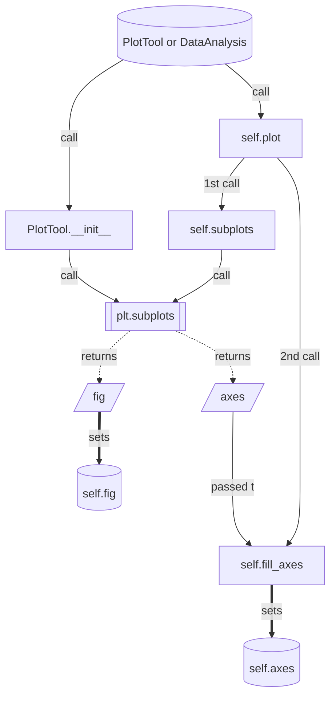

# plotastic

**Combining seaborn and pingouin into convenient data analysis!**

## Installation 📦

``` bash
pip install git+https://github.com/markur4/plotastic.git
```

## Information 📚
### Why use plotastic? 🤔

<details>
<summary> 🤔 Why use plotastic? (click to unfold) </summary>

#### Optimized Workflow:
- Plot figures and perform statistics in few lines!
- No need need to retype the same arguments all over again!
- Make multi-layered pre-configured plots in just one line!
- Save all plots and tables in one line!

#### Sturdy:
- plotastic doesn't re-invent the wheel: It's focused on using well established classes, functions and libraries (`pd.DataFrame`, `plt.subplots`, `sns.catplot`, pingouin, statannotations, etc). It's just a wrapper that makes it easier to use them together!
- plotastic provides feedback on how each step of data transformation, formatting or categorization has affected your table, giving beginners the confidence of knowing what they're doing!
  
#### Controllable:
- plotastic outputs common matplotlib figures (`ax, fig`). You can modify them like any other!
- User arguments are passed through to seaborn and pingouin, so you can use all their options!

#### Easy:
- Don't google/remember code, print out pre-built snippets of complex multi-layered plots and modify them!

#### Reviewable:
- We provide snippets that demonstrate of what just happened under the hood, so you can backcheck and thoroughly document your work!
</details>


### Workflow ⏳

<details>
<summary> ⏳ Workflow (click to unfold) </summary>

1. **🧮 Import & Prepare your pandas DataFrame**
   - We require a long-format pandas dataframe with categorical columns
   - If it works with seaborn, it works with plotastic!
2. **🔀 Make a DataAnalysis Object**
   - `DataAnalysis(DataFrame, dims={x, y, hue, row, col})`
   - Check for empty data groups, differing samplesizes, NaN-count, etc. automatically
3. **✅ Explore and Adapt Data**
   - Quick preliminary plotting
   - Categorize multiple columns at once
   - Transform dependent variable
   - Each step warns you, if you introduced NaNs without knowledge!
4. **✨ Perform statistical tests** ✨
   - Currently just PostHoc tests (`pg.pairwise_tests` and all its options), more will soon follow ((RM-)ANOVA, Kruskal, Spearman, etc!)  !
5. **📊 Plot figure**
   - Print ready to use matplotlib snippets (kinda like Copilot, but tested!) ...
   - ... or execute automated functions!
   - Annotate statistical results in one line and with great control over which parameters to show!
6. **💿 Save all results at once!**
   - One DataAnalysis object holds 1 DataFrame, 1 figure and multiple statistical results!

</details>


### How plotastic translates seaborn into statistical terms! 📊

<details>
<summary> 📊 (click to unfold) </summary>

- Every Data is separable into seaborn's `x`, `y`, `hue`, `row`, `col` dimensions
- These dimensions are assigned to statistical terms:
  - `y` is the ***dependent variable*** (***DV***)
  - `x` and `hue` are ***independent variables*** (***IV***) and are treated as ***within/between factors*** (categorical variables)
  - `row` and `col` are ***grouping variables*** (categorical variables)
  - A `subject` may be specified for within/paired study designs (categorical variable)
- For each level of `row` or `col` (or for each combination of `row`- and `col` levels), statistical tests will be performed with regards to the two-factors `x` and `hue`
- Example with ANOVA:
  - If `x = "day"`, `hue = "gender"`, `row = "smoker"`, `col = "age-group"`, then for each level of `smoker` and `age-group` (e.g. `smoker: "yes"` and `age-group: "young"`), a *two-way ANOVA* will be performed with `day` and `gender` as factors.
  - Three-way ANOVAs are not possible (yet), since that would require setting e.g. `col` as the third factor, or implementing another dimension (e.g. `hue2`).
</details>


### Disclaimer about Statistics (READ if you're new to statistics) ❗️

<details>
<summary>❗️ Disclaimer about Statistics (Click to unfold)</summary>


#### The author is not a dedicated statistician! BUT, he derives his knowledge from ...

- ... ***Intuitive Biostatistics*** - Fourth Edition (2017); Harvey Motulsky
- ... ***Introduction to Statistical Learning with applications in Python*** - First Edition (2023); Gareth James, Daniela Witten, Trevor Hastie, Robert Tibshirani, Jonathan Taylor
- ... talking to other scientists struggling with statistics

**✅ plotastic can help you with...**

- ... gaining some practical experience when learning statistics
- ... quickly gain statistical implications about your data without switching to another software
- ... making first steps towards a full statistical analysis
- ... plotting publication grade figures (without statistics)
- ... publication grade statistical analysis **IF** you really know what you're doing OR you have back-checked your results by a professional statistician
- ... quickly test data transformations (log)

**🛑 plotastic can NOT ...**

- ... replace a professional statistician
- ... teach you statistics, you need some basic knowledge (but plotastic is awesome for practicing!)
- ... test for multicolinearity (Absence of multicolinearity is required by ANOVA!)
- ... perform stringent correction for multiple testing (e.g. bonferoni), as statistical tests are applied to sub-facets of the whole dataframe for each axes, which depends on the definition of x, hue, col, etc. Hence, corrected p-values might over-estimate the significance of your results.


#### Be **critical** and **responsible** with your statistical analysis!

- **Expect Errors:** Don't trust automated systems like this one!
- **Document your work in *ridiculous detail***:
  - Include the applied tests, the number of technical replicates and the number of biological/independent in each figure legend
  - State explicitly what each datapoint represents:
    - 1 datapoint = 1 Technical replicate?  
    - 1 datapoint = The mean of all technical replicate per independent replicate/subject?
  - State explicitly what the error-bars mean: Standard deviation? Confidence interval?
  - (Don't mix technical with biological/independent variance)
  - Report if/how you removed outliers
  - Report if you did or did not apply correction methods (multiple comparisons, Greenhouse Geyser, etc.) and what your rationale is (exploratory vs. confirmatory study? Validation through other methods to reduce Type I error?)
- **Check results with professionnals:**
  - *"Here is my data, here is my question, here is my analysis, here is my interpretation. What do you think?"*

</details>

## Features ⚙️

### Implementation List ⚙️

<details>
<summary>⚙️ Feature List (click to unfold) </summary>


#### *Implemented*
- **Base plotting and Editing of plots:**
  - Done 90%
  - All (non-facetgrid) seaborn plots should work
- **Multi-Layered single-line plots**
  - Multi-layerd plots with arguments configured for one another
  - Box-plot + swarm/strip
- **PostHoc**
  - pg.pairwise_tests works with all primary options
- **Plot Annotations**
  - Stars! PostHoc Tables can be annotated in plots and specific pairs are user-selectable!

#### *Planned*
- **Plotting:**
  - QQ-Plot
  - Kaplan-Meyer plots
- **Assumption testing:**
  - Normality (Shapiro-Wilk)
  - Sphericity (Levene)
- **Omnibus tests:**
  - All of 'em, ANOVA, kruskal, etc.
- **Post-hoc tests:**
  - Make correction for multiple testing go over complete DataFrame and not Facet-wise.
- **Bivariate tests:**
  - Make an special sub-class of dims for `x` that handles numerical and categorical types so that we don't get cryptic error messages when trying to plot a scatterplot with a numerical `x` and a categorical `hue`.
  - Function to convert numerical data into categorical data by binning
  - Pearson, Spearman, Kendall
- **Plot Annotations**
  - Omnibus results


#### *Maybe..?*
- Interactive MultiPlot (where you click stuff and adjust scale etc.)
- Full Pipelines:
  - Putting all those statistical tests into one line. 
  - Will work on this only after everything's implemented and working confidently and well! 
  - Sth. like this:
    - `between_samples(parametric=True)`:    ANOVA + Tukey (✅ Normality, ✅ Homoscedasticity )
    - `between_samples(parametric=False)`:  Kruskal-Wallis + Dunn
    - `within_samples(parametric=True)`:      RM-ANOVA + multiple paired t-tests (✅ Normality, ✅ Sphericity)
    - `within_samples(parametric=False)`:    Friedman + multiple Wilcoxon


#### *Not planned*
- Support for seaborn FacetGrid
  - Plotastic uses matplotlib figures and fills its axes with seaborn plot functions. In my opinion, that's the best solution that offers the best adaptibility of every plot detail while bieng easy to maintain
- Support for seaborn objects (same as Facetgrid)

#### *Not possible*
- NOTHING


</details>


### Internal Structure of Plotastic 🌳

<details>
<summary>🌳 Class Diagram (click to unfold) </summary>

🛑 **Not everything shown here is implemented!** 🛑 But this is where we're headed. See Features to see what's possible and what not

```mermaid
classDiagram
   
   class WorkingDirectory{
      <<service>>
      SCRIPT_NAME
      SCRIPT_PATH
      SCRIPT_EXTENSION
      SCRIPT_FILEPATH
      cwd
      current_time: str = filer.IMPORTTIME
      _current_day(property): -> str
      _is_notebook(): -> bool
      set_cwd(path: str)
   }

   class Filer{
      <<service>>
      title: str ="untitled"
      ...
      _path_subfolder(property)
      _path_subsubfolder(property)
      _parent(property)
      _path_file(property)
      add_to_title(to_end:str, to_start:str): -> str
      ....()
   }

   WorkingDirectory <|-- Filer
   Filer *-- DataAnalysis



   %% ANALYSIS #......................................................................................

   class pd_DataFrame{
      ...
      ....()
   }

   class Dims {
      x: str 
      y: str
      hue: str =None
      row: str =None
      col: str =None
      set(**kwargs, inplace: bool =False)
      switch(*keys, **kwargs inplace: bool =False)
   }

   class DimsAndLevels {

      data: pd.DataFrame
      dims: Dims

      title.setter()
      _NaNs(property) 
      %%_empty_groups(property)
      _factors_all(property) [x,y,hue,row,col]
      _factors_xhue(property) [x,hue]
      _factors_rowcol(property) [row,col]
      _vartypes(property) = dict(f1:'categorical', f2:'continuous', ...)
      _levels(property) = dict(f1:[l1, l2, ...], f2:[...], ...)
      ....()
   }
   click DimsAndLevels href "https://github.com/markur4/plotastic/blob/main/plotastic/dimsandlevels.py" "DimsAndLevels.py"
  
   pd_DataFrame *-- DimsAndLevels
   Dims *-- DimsAndLevels




   class DataFrameTool{
      user_levels: dict =None
      subject: str =None
      verbose: bool =False
      catplot(kind="strip") -> sns.FacetGrid
      describe_data() -> pd.DataFrame
      transform() -> Analysis
      categorize() -> pd.DataFrame
      ....()
   }
  click DataFrameTool href "https://github.com/markur4/plotastic/blob/main/plotastic/dataframetool.py" "DimsAndLevels.py"

   DimsAndLevels <|-- DataFrameTool
   DataFrameTool <|-- PlotTool
   %%Analysis <|-- Assumptions
   %%Analysis <|-- Omnibus
   %%Analysis <|-- PostHoc
   DataFrameTool <|-- StatTest

   %% STATISTICS #......................................................................................

   class pingouin{
      <<Statistics Library>>
      anova()
      rm_anova()
      pairwise_tests()
      ....()
   }

   class StatResults{
      <<Storage>>
      normality: pd.DataFrame = "not tested"
      homoscedasticity: pd.DataFrame = "not tested"
      sphericity: pd.DataFrame = "not tested"
      posthoc: pd.DataFrame = "not tested"
      omnibus: pd.DataFrame = "not tested"
      bivariate: pd.DataFrame = "not tested"
      ...
      normal(property):bool ="not assessed"
      homoscedastic(property):bool ="unknown"
      spherical(property):bool ="unknown"
      parametric(property):bool =None
      assess_normality()
      assess_homoscedasticity()
      assess_sphericity()
      ....()
   }

   class StatTest{
      <<BaseObject>>
      ALPHA: float = 0.05
      ALPHA_TOLERANCE: float = 0.075
      results: StatResults 
      ...
      set_alpha()
      set_alpha_tolerance()
      _p_to_stars(p: float) -> str
      _effectsize_to_words(effectsize: float) -> str
      ....()


   }
   StatResults *-- StatTest


   class Assumptions{
      ...
      check_normality()
      check_normality_snip()
      check_sphericity()
      check_sphericity_snip()
      check_homoscedasticity()
      check_homoscedasticity_snip()
      check_all_assumptions()
      check_all_assumptions_snip()
      ....()
   }
   StatTest <|-- Assumptions

   class Omnibus{
      ...
      significant_factors(property): dict
      omni_anova()
      omni_anova_snip()
      omni_rmanova()
      omni_rmamova_snip()
      omni_kruskal()
      omni_kruskal_snip()
      ....()
   }
   class PostHoc{
      ...
      significant_pairs(property): pd.DataFrame
      test_pairwise(paired, parametric)
      ....()
   }
   class Bivariate{
      ...
      test_pearson()
      test_pearson_snip()
      test_spearman()
      test_spearman_snip()
      test_kendall()
      test_kendall_snip()
      ....()
   }

   Assumptions  <|-- PostHoc
   Assumptions  <|-- Omnibus
   Assumptions  <|-- Bivariate
   pingouin .. Assumptions: Uses


   %% PLOTTING #......................................................................................

   class rc{
      <<Runtime Config>>
      FONTSIZE
      STYLE_PAPER
      STYLE_PRESENTATION
      set_style()
   }

   class matplotlib{
      <<Plotting Objects>>
      ...
      Axes
      Figure
      fig.legend()
      ....()
   }

   class PlotTool{
      fig: mpl.figure.Figure
      axes: mpl.axes.Axes
      buffer: io.BytesIO
      ...
      subplots() -> (fig, axes)
      fillaxes(kind="strip") -> (fig, axes)
      plot(kind="strip") -> (fig, axes)

      axes_nested(property) -> np.ndarray(axes).shape(1,1)
      axes_iter__key_ax(property) -> ax
      
      save_plot_tofile() -> None
      save_plot_tobuffer() -> io.BytesIO
      load_plot_frombuffer() -> (fig, axes)
   }
matplotlib *-- PlotTool
matplotlib <.. rc: Configures

   class PlotEdits{
      edit_titles(titles:dict) -> None
      edit_titles_SNIP()
      edit_labels(labels:dict) -> None
      edit_labels_SNIP()
      edit_ticks(ticks:dict) -> None
      edit_ticks_SNIP()
      ....()
   }
   
PlotTool <|-- PlotEdits

   class MultiPlot{
      <<Library of pre-built Plots>>
      ...
      plot_box_strip()
      plot_box_strip_SNIP()
      plot_bar_strip()
      plot_bar_strip_SNIP()
      plot_paired_dots()
      plot_paired_dots_SNIP()
      plot_scatter_with_line()
      plot_scatter_with_line_SNIP()
      plot_qqplot()
      ....()
   }

   PlotEdits <|-- MultiPlot



   %% DATAANALYSIS #......................................................................................

   class Annotator{
      ...
      check_pairs()
      annotate_pairwise()
   }

   MultiPlot <|-- Annotator
   Omnibus <|-- Annotator
   PostHoc <|-- Annotator
   Bivariate <|-- Annotator

   class DataAnalysis{

      <<Interface>>
      %% FIGURES DON'T NEED TITLES, WE EDIT THEM AFTERWARDS
      title = "untitled" 
      filer: Filer 
      ...
      save_all_tofile()
      save_all_tobuffer()
      load_all_frombuffer()

      annot_stars(axes) -> (fig, axes)

      ....()
   }
   click DataAnalysis href "https://github.com/markur4/plotastic/blob/main/plotastic/dataanalysis.py" "dataanalysis.py"

  Annotator --|> DataAnalysis


```


</details>


<details>
<summary>📈 Pseudo-Flowchart how plotting works (click to unfold) </summary>



</details>


## Cite these papers! ✍🏻

- *Vallat, R. (2018). Pingouin: statistics in Python. Journal of Open Source Software, 3(31), 1026. <https://doi.org/10.21105/joss.01026>*
- *Waskom, M. et al. (2021). mwaskom/seaborn: v0.11.1 (January 2021). Zenodo. <http://doi.org/10.5281/zenodo.4547176>*

## Step by step 👈🤞👇👌

### 🧮 Prepare your data in a long-format DataFrame

- `row`, `col` (and `x`) have to be of type `pd.Categorical`!

### 🔀 Initialize `DataAnalysis`

``` python
import seaborn as sns
import plotastic as plst

DF = sns.load_dataset('tips')
DA = plst.DataAnalysis(data = DF, x, y, hue, row, col)
```

**Why is that useful?**

- See how data is organized for each groups
  - group = A sample with a unique combination of `x`, `hue`, `row` and `col`, that shows the technical/biological distribution of a dependent variable `y`. Its samplesize *n* contributes to statistical power.
  - Show levels and n-count for each group
  - Show mean, std, skew, etc. of numerical columns
- Check integrity of data
  - Check samplesize per group
  - Detect empty groups
  - NaN-count per group

### 📊 Plot Data

lorem ipsum dolor

#### Initialize pyplot figure with pre-built function

lorem ipsum dolor

#### Fill axes with seaborn MultiPlot

Use pre-built loops

#### Modify figure like any pyplot figure

lorem ipsum dolor

### ✨ Perform Statistics

lorem ipsum dolor

#### Check assumptions

lorem ipsum dolor

#### Omnibus

lorem ipsum dolor

#### Post-Hoc Analysis

lorem ipsum dolor

#### Automated pipelines


lorem


