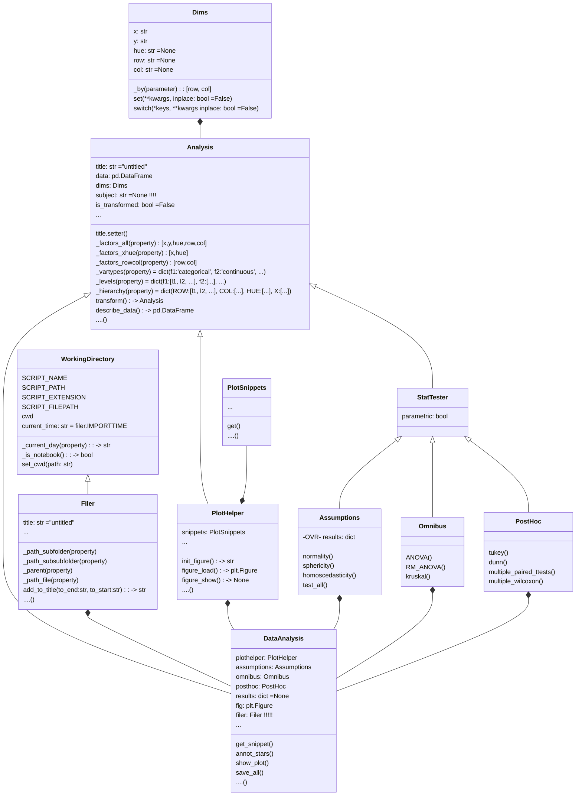

# plotastic

a wrapper for seaborn plotters for convenient statistics powered by pingouin!

## Installation

``` bash
pip install git+https://github.com/markur4/plotastic.git
```

## Why use plotastic?

* **Fast** 
  * Make figures and statistics with just a few lines!
* **Controllable**
    * Outputs common matplotlib figures 
    * Captures hidden state of matplotlib so that plot is re-usable and modifyable at any point in your notebook/script!
* **Easy**
    * Don't google/remember code, print out pre-built snippets of complex plots and modify them!
* **Sturdy**
    * plotastic doesn't re-invent the wheel: It's combining these packages:
        * maplotlib
        * seaborn
        * pingouin
        * statannotator

## Workflow

1. **🧮 Prepare your pandas DataFrame in a long-format DataFrame**
2. **🔀 `DA = DataAnalysis(DataFrame, x, y, hue, row, col)`**
3. **📊 Use `DataAnalysis` to plot figure**
    1. Initialize pyplot (fig, ax) with pre-built methods
    2. Fill axes with seaborn plots using pre-built loops
    3. Modify figure like any pyplot figure
4. **✨ Use DataAnalysis to perform statistical tests**
    1. Check Normality of all data-groups and other Assumptions (homoscedasticity Levene, sphericity Mauchly, etc.)
    2. Perform Omnibus test (ANOVA, Kruskal-Wallis, Friedman, etc.)
    3. Perform post-hoc/pairwise tests (multiple (paired) t-tests/Tukey)
    4. ... Or apply automated statistical pipelines if you are unsure which tests to combine!
        * `between_samples(parametric=True)`: ANOVA + Tukey (✅ Normality, ✅ Homoscedasticity )
        * `between_samples(parametric=False)`: Kruskal-Wallis + Dunn
        * `within_samples(parametric=True)`: RM-ANOVA + multiple paired t-tests (✅ Normality, ✅ Sphericity)
        * `within_samples(parametric=False)`: Friedman + multiple Wilcoxon

## ❗️Statistics is complex and dangerous!

The author is not a dedicated statistician. He derives his knowledge from ...
-  ... *Intuitive Biostatistics - Fourth Edition (2017) Harvey MotulskyOxford University Press*
-  ... talking to other scientists struggling with statistics

##### ✅ What can plotastic do?
Plotastic can ...
* ... help you choose correct statistical tests
* ... provide a playground to experiment with plotting and statsistics which can turn into ...
  * ... publication grade figures
  * ... publication grade statistical analysis **IF** ...
    * ... you really know what you're doing OR ...
      * ... you have back-checked your results by a professional statistician
* ... quickly test data transformations (log)

##### 🛑 What can plotastic NOT do?
- Test for multicolinearity (Absence of multicolinearity is required by ANOVA!)
- Teach you statistics, you need some basic knowledge
- Replace a professional statistician

> ##### Be **critical** and **responsible** with your statistical analysis!
> 
> * **Expect Errors:**
>     * Don't trust automated systems like this one!
> * <b>Document your work in *ridiculous detail*</b>:
>     * Include in your Methods/Supplemental:
>         * ... how technical and biological replicates contributed to your data
>         * ... if/how you removed outliers
>         * ... if you did or did not apply correction methods (multiple comparisons, Greenhouse Geyser, etc.) and what your rationale is (exploratory vs. confirmatory study?, validation through other methods to reduce Type II error?)
>     * Include in each figure legend:
>         * The number of technical replicates (per datapoint) and biological/independent replicates (per group)
>         * The statistical test(s) used
> * **Check results with professionnals:**
>     * *"Here is my data, here is my question, here is my analysis, here is my interpretation. What do you think?"*

## Step by step

### 🧮 Prepare your data in a long-format DataFrame

Useful functions:

* pandas
    * `pandas.melt()`
* consider markurutils!
    * `markurutils.melter()`
    * etc.

### 🔀 Initialize `DataAnalysis`

``` python
import seaborn as sns
import plotastic as plst

DF = sns.load_dataset('tips')
DA = plst.DataAnalysis(data = DF, x, y, hue, row, col)
```

##### What does it do?

* See how data is organized for each groups
    * group = A sample with a unique combination of `x`, `hue`, `row` and `col`, that shows the technical/biological distribution of a dependent variable `y`. Its samplesize *n* contributes to statistical power.
    * Show levels and n-count for each group
    * Show mean, std, skew, etc. of numerical columns
* Check integrity of data
    * Check samplesize per group
    * Detect empty groups
    * NaN-count per group

### 📊 Plot Data

lorem

##### Initialize pyplot figure with pre-built function

lorem

##### Fill axes with seaborn plots

Use pre-built loops

##### Modify figure like any pyplot figure

### ✨ Perform Statistics

lorem

##### Check assumptions

lorem

##### Omnibus

lorem

##### Automated pipelines

lorem

## Tests that are implemented and work

* Normality (Shapiro-Wilk)
* Sphericity (Levene)
*


## Please Cite these papers!

* *Vallat, R. (2018). Pingouin: statistics in Python. Journal of Open Source Software, 3(31), 1026. https://doi.org/10.21105/joss.01026*
* *Waskom, M. et al. (2021). mwaskom/seaborn: v0.11.1 (January 2021). Zenodo. http://doi.org/10.5281/zenodo.4547176*


## Class Diagram
