# `plotastic`

**Translating `seaborn` into inferential statistics powered by `pingouin`!**

## Installation 📦

``` bash
pip install git+https://github.com/markur4/plotastic.git
```

## Information 📚 
*(click to unfold)*

<details><summary> 🤔<b><i> Why use plotastic?  </i></b> </summary>
<blockquote>
<hr>

#### Statistics made Posssible for EVERYONE:
- Well-known and intuitive parameters used in `seaborn` (***x***, ***y***, ***hue***, ***row***, ***col***)
   are 'translated' into terms used for inferential statistics (*between*, *within*,
  *dv*, etc.) 
  - **-> *If you know how to plot with seaborn, you can apply basic statistical
    analyses!***
- No need need to retype the same arguments of column names into all different tests!

#### Optimized Plotting with `matplotlib`:
- Make multi-layered pre-configured plots in just one line!
- Don't google/remember code, print out pre-built snippets of complex multi-layered
  plots and modify them!

#### Sturdy:
- plotastic doesn't re-invent the wheel: It's focused on using well established classes,
  functions and libraries (`pd.DataFrame`, `plt.subplots`, `sns.catplot`, pingouin,
  statannotations, etc). It's just a wrapper that makes it easier to use them together!
- plotastic provides feedback on how each step of data import, transformation, formatting or
  categorization has affected your table, giving beginners the confidence of knowing
  what they're doing!
  
#### Controllable:
- plotastic outputs common matplotlib figures (`ax`, `fig`). You can modify them like
  any other!
- User keyword arguments are passed through plotastic to `seaborn` and `pingouin`, so
  you can use all their options!


#### Reviewable:
- We provide snippets that demonstrate of what just happened under the hood, so you can
  backcheck and thoroughly document your work!

</blockquote>
</details>


<details><summary> ⏳<b><i> Workflow Summary</b> </i>  </summary>
<blockquote>
<hr>

1. **🧮 Import & Prepare your pandas DataFrame**
   - We require a long-format pandas dataframe with categorical columns
   - If it works with seaborn, it works with plotastic!
2. **🔀 Make a DataAnalysis Object**
   - `DataAnalysis(DataFrame, dims={x, y, hue, row, col})`
   - Check for empty data groups, differing samplesizes, NaN-count, etc. automatically
3. **✅ Explore Data**
   - Check Data integrity, unequal samplesizes, empty groups, etc.
   - Quick preliminary plotting with e.g. `DataAnalysis.catplot()`
4. **🔨 Adapt Data**
   - Categorize multiple columns at once
   - Transform dependent variable
   - Each step warns you, if you introduced NaNs without knowledge!
   - etc.
5. **✨ Perform Statistical Tests** ✨
   - Check Normality, Homoscedasticity, Sphericity
   - Perform Omnibus tests (ANOVA, RMANOVA, Kruskal-Wallis, Friedman)
   - Perform PostHoc tests (Tukey, Dunn, Wilcoxon, etc.) based on `pg.pairwise_tests()`
6. **📊 Plot figure**
   - Use pre-defined and optimized multi-layered plots with one line (e.g. strip over
     box)!
   - Print ready to use matplotlib snippets (kinda like Copilot, but tested!) ...
   - Annotate statistical results (\*, \*\*, \*\*\*, etc.) with full control over which
     data to include or exclude!
7. **💿 Save all results at once!**
   - One DataAnalysis object holds: 
     - One DataFrame in `self.data`
     - One Figure in `self.fig`, `self.axes`
     - Multiple statistical results: `self.results`
   - Use `DataAnalysis.save_statistics()` to save all results to different sheets
     collected in one .xlsx filesheet per test

</blockquote>
</details>


<details><summary> 📊<b><i> Translating Plots into Statistics!</i> </b> </summary>
<blockquote>
<hr>

### In Principle:
- Categorical data is separable into `seaborn`'s categorization parameters: ***x***,
  ***y***, ***hue***, ***row***, ***col***. We call those *"dimensions"*.
- These dimensions are assigned to statistical terms:
  - ***y*** is the ***dependent variable*** (***DV***)
  - ***x*** and ***hue*** are ***independent variables*** (***IV***) and are treated as
    ***within/between factors*** (categorical variables)
  - ***row*** and ***col*** are ***grouping variables*** (categorical variables)
  - A ***subject*** may be specified for within/paired study designs (categorical variable)
- For each level of ***row*** or ***col*** (or for each combination of ***row***- and ***col*** levels),
  statistical tests will be performed with regards to the two-factors ***x*** and ***hue***

### Example with ANOVA:
- Imagine this example data: 
  - Each day you measure the tip of a group of people. 
  - For each tip, you note down the ***day***, ***gender***, ***age-group*** and whether they ***smoke*** or
    not. 
  - Hence, this data has 4 categorical dimensions, each with 2 or more *levels*:
    - ***day***: 4 levels (*monday*, *tuesday*, *wednesday*, *Thursday*)
    - ***gender***: 2 levels (*male*, *female*)
    - ***age-group***: 2 levels (*young*, *old*)
    - ***smoker***: 2 levels (*yes*, *no*)
- Each category is assigned to a place of a plot, and when calling statistical tests, we
  assign them to statistical terms (in comments):
  - ```python
      # dims is short for dimensions
      dims = dict(         # STATISTICAL TERM:
         y = "tip",        # -> dependent variable
         x = "day",        # -> independent variable (within/between factor)
         hue = "gender",   # -> independent variable (within/between factor)
         row = "smoker",   # -> grouping variable
         col = "age-group" # -> grouping variable
      )
      ```
- We perform statistical testing groupwise:
  - For each level-combinations of ***smoker*** and ***age-group***, a two-way ANOVA
    will be performed (with ***day*** and ***gender*** as ***between*** factors for each
    datagroup):
    - 1st ANOVA includes datapoints where ***smoker**=yes* AND ***age-group**=young*
    - 2nd ANOVA includes datapoints where ***smoker**=yes* AND ***age-group**=old*
    - 3rd ANOVA includes datapoints where ***smoker**=no* AND ***age-group**=young*
    - 4th ANOVA includes datapoints where ***smoker**=no* AND ***age-group**=old*
  - Three-way ANOVAs are not possible (yet), since that would require setting e.g. ***col***
  as the third factor, or implementing another dimension (e.g. ***hue2***).

[//]:<end of 📊 Translating Plots into Statistics!>
</blockquote>
</details>


<details><summary> <b>❗️<i> Disclaimer about Statistics </i></b> </summary>
<blockquote>
<hr>

### This software was inspired by ...

- ... ***Intuitive Biostatistics*** - Fourth Edition (2017); Harvey Motulsky
- ... ***Introduction to Statistical Learning with applications in Python*** - First
  Edition (2023); Gareth James, Daniela Witten, Trevor Hastie, Robert Tibshirani,
  Jonathan Taylor
- ... talking to other scientists struggling with statistics

#### ✅ `plotastic` can help you with...

- ... gaining some practical experience when learning statistics
- ... quickly gain statistical implications about your data without switching to another
  software
- ... making first steps towards a full statistical analysis
- ... plotting publication grade figures (check statistics results with other software)
- ... publication grade statistical analysis **IF** you really know what you're doing OR
  you have back-checked your results by a professional statistician
- ... quickly test data transformations (log)

#### 🚫 `plotastic` can NOT ...

- ... replace a professional statistician
- ... teach you statistics, you need some basic knowledge (but is awesome for
  practicing!)
- ... test for multicolinearity (Absence of multicolinearity is required by ANOVA!)
- ... perform stringent correction for multiple testing (e.g. bonferoni), as statistical
  tests are applied to sub-facets of the whole dataframe for each axes, which depends on
  the definition of x, hue, col, etc. Hence, corrected p-values might over-estimate the
  significance of your results.


#### 🟡 Be **critical** and **responsible** with your statistical analysis!

- **Expect Errors:** Don't trust automated systems like this one!
- **Document your work in *ridiculous detail***:
  - Include the applied tests, the number of technical replicates and the number of
    biological/independent in each figure legend
  - State explicitly what each datapoint represents:
    - 1 datapoint = 1 Technical replicate?  
    - 1 datapoint = The mean of all technical replicate per independent
      replicate/subject?
  - State explicitly what the error-bars mean: Standard deviation? Confidence interval?
  - (Don't mix technical with biological/independent variance)
  - Report if/how you removed outliers
  - Report if you did or did not apply correction methods (multiple comparisons,
    Greenhouse Geyser, etc.) and what your rationale is (exploratory vs. confirmatory
    study? Validation through other methods to reduce Type I error?)
- **Check results with professionnals:**
  - *"Here is my data, here is my question, here is my analysis, here is my
    interpretation. What do you think?"*

[//]:<end of ❗️ Disclaimer about Statistics>
</blockquote>
</details>


## Features ⚙️
*(click to unfold)*

<details><summary>  ✅ <b><i> Feature List </i></b> </summary>
<blockquote>
<hr>

- **✅: Implemented and tested**
- **👍: Implemented**
- **📆: Planned (no date)**
- **🤷: Maybe..? (Rather not...)**
- **🚫: Not planned, don't want**
- **😣: Help Please..?**


<details open><summary>  <b><i>  Plotting   </i></b> </summary>
<blockquote>

- ✅ Make and Edit Plots: *Implemented ✅*
  - *All (non-facetgrid) seaborn plots should work, not tested*
- 👍 Printable Code Snippets: *Implemented ✅*
- 📆 QQ-Plot
- 📆 Kaplan-Meyer-Plot
- 🤷 Interactive Plots (where you click stuff and adjust scale etc.)
  - *That's gonna be alot of work!*
- 🚫 Support for `seaborn.FacetGrid`
  - *Why not? - `plotastic` uses matplotlib figures and fills its axes with seaborn plot
    functions. In my opinion, that's the best solution that offers the best adaptibility
    of every plot detail while bieng easy to maintain*
- 🚫 Support for `seaborn.objects` (same as Facetgrid)
  - *Why not? - I don't see the need to refactor the code*
- 😣 **NEED HELP WITH:** The hidden state of `matplotlib` figures/plots/stuff that gets drawn:
  - *I want to save the figure in `DataAnalysis.fig` attribute. As simple as that sounds,
    matplotlib does weird stuff, not applying changes after editing the plot.* 
  - *It'd be cool if I could control the changes to a DataAnalysis object better (e.g.
    using `inplace=True` like with `pd.DataFrames`). But I never figured out how to
    control matplotlib figure generation, even with re-drawing the figure with canvas.
    It's a mess and I wasted so much time already.*
</blockquote>
</details>


<details open><summary>  <b><i>  Multi-Layered Plotting   </i></b> </summary>
<blockquote>

- ✅ Box-plot + swarm
- 👍 Box-plot + strip
- 📆 Violin + swarm/strip
</blockquote>
</details>


<details open><summary>  <b><i>  Statistics   </i></b> </summary>
<blockquote>

- Assumption testing
  - ✅ Normality (e.g. Shapiro-Wilk)
  - ✅ Homoscedasticity (e.g. Levene)
  - ✅ Sphericity (e.g. Mauchly)
- Omnibus tests
  - ✅ ANOVA, RMANOVA, Kruskal-Wallis, Friedman
  - 📆 Mixed ANOVA
  - 📆 Annotate Results into Plot
- PostHoc
  - ✅ `pg.pairwise_tests()`
    - *Works with all primary options. That includes all parametric,
    non-parametric, paired, unpaired, etc. tests (t-test, paired t-test, MWU, Wilcoxon,
    etc.)*
  - ✅ Annotate Stars into plots (\*, \*\*, etc.)
    - *Specific pairs can be included/excluded from annotation*
  - 📆 Make correction for multiple testing go over complete DataFrame and not Facet-wise: 
- Bivariate
  - 📆 Find and Implement system to switch between numerical and categorical x-axis
    - *Function to convert numerical data into categorical data by binning?*
  - 📆 Pearson, Spearman, Kendall
- Printable Snippets
  - 📆 Snippets for all implemented tests
</blockquote>
</details>


<details open><summary>  <b><i>   Analysis Pipelines   </i></b> </summary>
<blockquote>

*Idea: Put all those statistical tests into one line. I might work on this only after
everything's implemented and working confidently and well!*
- 🤷 `between_samples(parametric=True)`:    ANOVA + Tukey (if Normality &
  Homoscedasticity are given)
- 🤷 `between_samples(parametric=False)`:  Kruskal-Wallis + Dunn
- 🤷 `within_samples(parametric=True)`:      RM-ANOVA + multiple paired t-tests (if
  Normality & Sphericity are given)
- 🤷 `within_samples(parametric=False)`:    Friedman + multiple Wilcoxon
</blockquote>
</details>

[//]:<end of ✅ Feature List>
</blockquote> 
</details>


<details><summary>🌳 <b><i>Class Diagram (click to unfold) </b></i> </summary>
<blockquote>
<hr>


- 🛑 Not everything shown here is implemented and not everything that's implemented is shown here!
- 🖱️ **Click** on a class to see its source code!

```mermaid
classDiagram
   
   class WorkingDirectory{
      <<service>>
      SCRIPT_NAME
      SCRIPT_PATH
      SCRIPT_EXTENSION
      SCRIPT_FILEPATH
      cwd
      current_time: str = filer.IMPORTTIME
      _current_day(property): -> str
      _is_notebook(): -> bool
      set_cwd(path: str)
   }

   class Filer{
      <<service>>
      title: str ="untitled"
      ...
      _path_subfolder(property)
      _path_subsubfolder(property)
      _parent(property)
      _path_file(property)
      add_to_title(to_end:str, to_start:str): -> str
      ....()
   }

   WorkingDirectory <|-- Filer
   Filer *-- DataAnalysis



   %% ANALYSIS #......................................................................................

   class pd_DataFrame{
      ...
      ....()
   }

   class Dims {
      x: str 
      y: str
      hue: str =None
      row: str =None
      col: str =None
      set(**kwargs, inplace: bool =False)
      switch(*keys, **kwargs inplace: bool =False)
   }
   click Dims href "https://github.com/markur4/plotastic/blob/main/src/plotastic/dimensions/dims.py" "Dims.py"

   class DimsAndLevels {

      data: pd.DataFrame
      dims: Dims

      title.setter()
      %%_empty_groups(property)
      factors_all(property) [x,y,hue,row,col]
      factors_xhue(property) [x,hue]
      factors_rowcol(property) [row,col]
      levels_dict_factor(property) = dict(f1:[l1, l2, ...], f2:[...], ...)
      levelkeys(property) = [(f1_l1, f2_l1), (f1_l1, f2_l2), ...]
      ....()
   }
   click DimsAndLevels href "https://github.com/markur4/plotastic/blob/main/src/plotastic/dimensions/dimsandlevels.py" "DimsAndLevels.py"
  
   pd_DataFrame *-- DimsAndLevels
   Dims *-- DimsAndLevels




   class DataFrameTool{
      user_levels: dict =None
      subject: str =None
      verbose: bool =False
      catplot(kind="strip") -> sns.FacetGrid
      describe_data() -> pd.DataFrame
      transform() -> Analysis
      categorize() -> pd.DataFrame
      ....()
   }
  click DataFrameTool href "https://github.com/markur4/plotastic/blob/main/plotastic/dataframetool.py" "DimsAndLevels.py"

   DimsAndLevels <|-- DataFrameTool
   DataFrameTool <|-- PlotTool
   %%Analysis <|-- Assumptions
   %%Analysis <|-- Omnibus
   %%Analysis <|-- PostHoc
   DataFrameTool <|-- StatTest

   %% STATISTICS #......................................................................................

   class pingouin{
      <<Statistics Library>>
      anova()
      rm_anova()
      pairwise_tests()
      ....()
   }

   class StatResults{
      <<Storage>>
      normality: pd.DataFrame = "not tested"
      homoscedasticity: pd.DataFrame = "not tested"
      sphericity: pd.DataFrame = "not tested"
      posthoc: pd.DataFrame = "not tested"
      omnibus: pd.DataFrame = "not tested"
      bivariate: pd.DataFrame = "not tested"
      ...
      normal(property):bool ="not assessed"
      homoscedastic(property):bool ="unknown"
      spherical(property):bool ="unknown"
      parametric(property):bool =None
      assess_normality()
      assess_homoscedasticity()
      assess_sphericity()
      ....()
   }

   class StatTest{
      <<BaseObject>>
      ALPHA: float = 0.05
      ALPHA_TOLERANCE: float = 0.075
      results: StatResults 
      ...
      set_alpha()
      set_alpha_tolerance()
      _p_to_stars(p: float) -> str
      _effectsize_to_words(effectsize: float) -> str
      ....()


   }
   StatResults *-- StatTest


   class Assumptions{
      ...
      check_normality()
      check_normality_snip()
      check_sphericity()
      check_sphericity_snip()
      check_homoscedasticity()
      check_homoscedasticity_snip()
      check_all_assumptions()
      check_all_assumptions_snip()
      ....()
   }
   StatTest <|-- Assumptions

   class Omnibus{
      ...
      significant_factors(property): dict
      omni_anova()
      omni_anova_snip()
      omni_rmanova()
      omni_rmamova_snip()
      omni_kruskal()
      omni_kruskal_snip()
      ....()
   }
   class PostHoc{
      ...
      significant_pairs(property): pd.DataFrame
      test_pairwise(paired, parametric)
      ....()
   }
   class Bivariate{
      ...
      test_pearson()
      test_pearson_snip()
      test_spearman()
      test_spearman_snip()
      test_kendall()
      test_kendall_snip()
      ....()
   }

   Assumptions  <|-- PostHoc
   Assumptions  <|-- Omnibus
   Assumptions  <|-- Bivariate
   pingouin .. Assumptions: Uses


   %% PLOTTING #......................................................................................

   class rc{
      <<Runtime Config>>
      FONTSIZE
      STYLE_PAPER
      STYLE_PRESENTATION
      set_style()
   }

   class matplotlib{
      <<Plotting Objects>>
      ...
      Axes
      Figure
      fig.legend()
      ....()
   }

   class PlotTool{
      fig: mpl.figure.Figure
      axes: mpl.axes.Axes
      buffer: io.BytesIO
      ...
      subplots() -> (fig, axes)
      fillaxes(kind="strip") -> (fig, axes)
      plot(kind="strip") -> (fig, axes)

      axes_nested(property) -> np.ndarray(axes).shape(1,1)
      axes_iter__key_ax(property) -> ax
      
      save_plot_tofile() -> None
      save_plot_tobuffer() -> io.BytesIO
      load_plot_frombuffer() -> (fig, axes)
   }
matplotlib *-- PlotTool
matplotlib <.. rc: Configures

   class PlotEdits{
      edit_titles(titles:dict) -> None
      edit_titles_SNIP()
      edit_labels(labels:dict) -> None
      edit_labels_SNIP()
      edit_ticks(ticks:dict) -> None
      edit_ticks_SNIP()
      ....()
   }
   
PlotTool <|-- PlotEdits

   class MultiPlot{
      <<Library of pre-built Plots>>
      ...
      plot_box_strip()
      plot_box_strip_SNIP()
      plot_bar_strip()
      plot_bar_strip_SNIP()
      plot_paired_dots()
      plot_paired_dots_SNIP()
      plot_scatter_with_line()
      plot_scatter_with_line_SNIP()
      plot_qqplot()
      ....()
   }

   PlotEdits <|-- MultiPlot



   %% DATAANALYSIS #......................................................................................

   class Annotator{
      ...
      check_pairs()
      annotate_pairwise()
   }

   MultiPlot <|-- Annotator
   Omnibus <|-- Annotator
   PostHoc <|-- Annotator
   Bivariate <|-- Annotator

   class DataAnalysis{

      <<Interface>>
      %% FIGURES DON'T NEED TITLES, WE EDIT THEM AFTERWARDS
      title = "untitled" 
      filer: Filer 
      ...
      save_all_tofile()
      save_all_tobuffer()
      load_all_frombuffer()

      annot_stars(axes) -> (fig, axes)

      ....()
   }
   click DataAnalysis href "https://github.com/markur4/plotastic/blob/main/plotastic/dataanalysis.py" "dataanalysis.py"

  Annotator --|> DataAnalysis


```




[//]:<end of 🌳 Class Diagram>
</blockquote>
</details>


## Cite these papers! ✍🏻

- *Vallat, R. (2018). Pingouin: statistics in Python. Journal of Open Source Software,
  3(31), 1026. <https://doi.org/10.21105/joss.01026>*
- *Waskom, M. et al. (2021). mwaskom/seaborn: v0.11.1 (January 2021). Zenodo.
  <http://doi.org/10.5281/zenodo.4547176>*

## Step by step 👈🤞👇👌

### 🧮 Prepare your data in a long-format DataFrame

- `row`, `col` (and `x`) have to be of type `pd.Categorical`!

### 🔀 Initialize `DataAnalysis`

``` python
import seaborn as sns
import plotastic as plst

DF = sns.load_dataset('tips')
DA = plst.DataAnalysis(data = DF, x, y, hue, row, col)
```

**Why is that useful?**

- See how data is organized for each groups
  - group = A sample with a unique combination of `x`, `hue`, `row` and `col`, that
    shows the technical/biological distribution of a dependent variable `y`. Its
    samplesize *n* contributes to statistical power.
  - Show levels and n-count for each group
  - Show mean, std, skew, etc. of numerical columns
- Check integrity of data
  - Check samplesize per group
  - Detect empty groups
  - NaN-count per group

### 📊 Plot Data

lorem ipsum dolor

#### Initialize pyplot figure with pre-built function

lorem ipsum dolor

#### Fill axes with seaborn MultiPlot

Use pre-built loops

#### Modify figure like any pyplot figure

lorem ipsum dolor

### ✨ Perform Statistics

lorem ipsum dolor

#### Check assumptions

lorem ipsum dolor

#### Omnibus

lorem ipsum dolor

#### Post-Hoc Analysis

lorem ipsum dolor

#### Automated pipelines


lorem


