<h1 align="center">
  
</h1>

<h1 align="center">

[](https://github.com/psf/black)
[](https://codecov.io/gh/markur4/plotastic)
[](https://doi.org/10.21105/joss.06304)

</h1>


# `plotastic`: Bridging Plotting and Statistics


[//]:<== Installation =========================================================>
# 📦 Installation

#### Install from PyPi:
``` bash
pip install plotastic
```

#### Install from GitHub: (experimental, check CHANGELOG.md)
``` bash
pip install git+https://github.com/markur4/plotastic.git
```

### Requirements
- Python >= 3.11 *(not tested with earlier versions)*
- pandas == 1.5.3 *(pingouin needs this)*
- seaborn <= 0.12.2 *(later versions reworked hue)*

[//]:<== Information ==========================================================>
#  📷 Example Gallery

<details><summary> <b><i> (click to unfold)  </i></b> </summary>
<blockquote>
<hr>

<h1 align="center">
<hr>
🐁 Click on Images for Code! 🐁
<hr>

  <a href=https://github.com/markur4/plotastic/blob/main/EXAMPLES/qpcr.ipynb>
  
  </a>
  <a href=https://github.com/markur4/plotastic/blob/main/EXAMPLES/fmri.ipynb>
  
  </a> 
  <a href="https://github.com/markur4/plotastic/blob/main/EXAMPLES/attention.ipynb">
   
  </a>
  <a href=https://github.com/markur4/plotastic/blob/main/EXAMPLES/tips.ipynb> 
  
  </a> 
  <a href=https://github.com/markur4/plotastic/blob/main/EXAMPLES/iris.ipynb> 
  
  </a>
  <a href="https://github.com/markur4/plotastic/blob/main/EXAMPLES/cars.ipynb"> 
  
  </a>  
  <a href="https://github.com/markur4/plotastic/blob/main/EXAMPLES/diamonds.ipynb">
    
   
  </a>
  
</h1>


[//]:<-- end of Example Gallery 📷 -->
</blockquote>
</details>


[//]:<== Information ==========================================================>
# 🧑‍🏫 About `plotastic` 


[//]:<------------------------------------------------------------------------->
<details><summary> 🤔<b><i> Summary  </i></b> </summary>
<blockquote>
<hr>


`plotastic` addresses the challenges of transitioning from exploratory
data analysis to hypothesis testing in Python's data science ecosystem.
Bridging the gap between `seaborn` and `pingouin`, this library offers a
unified environment for plotting and statistical analysis. It simplifies
the workflow with a user-friendly syntax and seamless integration with
familiar `seaborn` parameters (y, x, hue, row, col). Inspired by
`seaborn`'s consistency, `plotastic` utilizes a `DataAnalysis` object to
intelligently pass parameters to `pingouin` statistical functions. The
library systematically groups the data according to the needs of
statistical tests and plots, conducts visualisation, analyses and
supports extensive customization options. In essence, `plotastic`
establishes a protocol for configuring statical analyses through
plotting parameters. This approach streamlines the process, translating
`seaborn` parameters into statistical terms, providing researchers and
data scientists with a cohesive and user-friendly solution in python.!


### Workflow:

1. **🧮 Import & Prepare your pandas DataFrame**
   - We require a long-format pandas dataframe with categorical columns
   - If it works with seaborn, it works with plotastic!
2. **🔀 Make a DataAnalysis Object**
   - `DataAnalysis(DataFrame, dims={x, y, hue, row, col})`
   - Check for empty data groups, differing samplesizes, NaN-count, etc.
     automatically
3. **✅ Explore Data**
   - Check Data integrity, unequal samplesizes, empty groups, etc.
   - Quick preliminary plotting with e.g. `DataAnalysis.catplot()`
4. **🔨 Adapt Data**
   - Categorize multiple columns at once
   - Transform dependent variable
   - Each step warns you, if you introduced NaNs without knowledge!
   - etc.
5. **✨ Perform Statistical Tests** ✨
   - Check Normality, Homoscedasticity, Sphericity
   - Perform Omnibus tests (ANOVA, RMANOVA, Kruskal-Wallis, Friedman)
   - Perform PostHoc tests (Tukey, Dunn, Wilcoxon, etc.) based on
     `pg.pairwise_tests()`
6. **📊 Plot figure**
   - Use pre-defined and optimized multi-layered plots with one line
     (e.g. strip over box)!
   - Annotate statistical results (p-values as \*, \*\*, \*\*\*, etc.)
     with full control over which data to include or exclude!
7. **💿 Save all results at once!**
   - One DataAnalysis object holds: 
     - One DataFrame in `self.data`
     - One Figure in `self.fig`, `self.axes`
     - Multiple statistical results: `self.results`
   - Use `DataAnalysis.save_statistics()` to save all results to
     different sheets collected in one .xlsx filesheet per test

[//]:<-- end of 🤔  Summary -->
</blockquote>
</details>


[//]:<------------------------------------------------------------------------->
<details><summary> 📊<b><i> Translating Plots into Statistics!</i> </b> </summary>
<blockquote>
<hr>

### In Principle:
- Categorical data is separable into `seaborn`'s categorization
  parameters: ***x***, ***y***, ***hue***, ***row***, ***col***. We call
  those *"dimensions"*.
- These dimensions are assigned to statistical terms:
  - ***y*** is the ***dependent variable*** (***DV***)
  - ***x*** and ***hue*** are ***independent variables*** (***IV***) and
    are treated as ***within/between factors*** (categorical variables)
  - ***row*** and ***col*** are ***grouping variables*** (categorical
    variables)
  - A ***subject*** may be specified for within/paired study designs
    (categorical variable)
- For each level of ***row*** or ***col*** (or for each combination of
  ***row***- and ***col*** levels), statistical tests will be performed
  with regards to the two-factors ***x*** and ***hue***

### Example with ANOVA:
- Imagine this example data: 
  - Each day you measure the tip of a group of people. 
  - For each tip, you note down the ***day***, ***gender***,
    ***age-group*** and whether they ***smoke*** or not. 
  - Hence, this data has 4 categorical dimensions, each with 2 or more
    *levels*:
    - ***day***: 4 levels (*monday*, *tuesday*, *wednesday*, *Thursday*)
    - ***gender***: 2 levels (*male*, *female*)
    - ***smoker***: 2 levels (*yes*, *no*)
    - ***age-group***: 2 levels (*young*, *old*)
- Each category is assigned to a place of a plot, and when calling
  statistical tests, we assign them to statistical terms (in comments):
  - ```python
      # dims is short for dimensions
      dims = dict(          # STATISTICAL TERM:
          y = "tip",        # y-axis, dependent variable
          x = "day",        # x-axis, independent variable (within-subject factor)
          hue = "gender",   # color,  independent variable (within-subject factor)
          col = "smoker",   # axes,   grouping variable
          row = "age-group" # axes,   grouping variable
      )
      ```
- We perform statistical testing groupwise:
  - For each level-combinations of ***smoker*** and ***age-group***, a
    two-way ANOVA will be performed (with ***day*** and ***gender*** as
    ***between*** factors for each datagroup):
    - 1st ANOVA assesses datapoints where ***smoker**=yes* AND
      ***age-group**=young*
    - 2nd ANOVA assesses datapoints where ***smoker**=yes* AND
      ***age-group**=old*
    - 3rd ANOVA assesses datapoints where ***smoker**=no* AND
      ***age-group**=young*
    - 4th ANOVA assesses datapoints where ***smoker**=no* AND
      ***age-group**=old*
  - Three-way ANOVAs are not possible (yet), since that would require
  setting e.g. ***col*** as the third factor, or implementing another
  dimension (e.g. ***hue2***).

[//]:<end of 📊 Translating Plots into Statistics! -->
</blockquote>
</details>


[//]:<------------------------------------------------------------------------->
<details><summary> <b>❗️<i> Disclaimer about Statistics </i></b> </summary>
<blockquote>
<hr>

### This software was inspired by ...

- ... ***Intuitive Biostatistics*** - Fourth Edition (2017); Harvey
  Motulsky
- ... ***Introduction to Statistical Learning with applications in
  Python*** - First Edition (2023); Gareth James, Daniela Witten, Trevor
  Hastie, Robert Tibshirani, Jonathan Taylor
- ... talking to other scientists struggling with statistics

#### ✅ `plotastic` can help you with...

- ... gaining some practical experience when learning statistics
- ... quickly gain statistical implications about your data without
  switching to another software
- ... making first steps towards a full statistical analysis
- ... plotting publication grade figures (check statistics results with
  other software)
- ... publication grade statistical analysis **IF** you really know what
  you're doing OR you have back-checked your results by a professional
  statistician
- ... quickly test data transformations (log)

#### 🚫 `plotastic` can NOT ...

- ... replace a professional statistician
- ... teach you statistics, you need some basic knowledge (but is
  awesome for practicing!)
- ... test for multicolinearity (Absence of multicolinearity is required
  by ANOVA!)
- ... perform stringent correction for multiple testing (e.g.
  bonferoni), as statistical tests are applied to sub-facets of the
  whole dataframe for each axes, which depends on the definition of x,
  hue, col, etc. Hence, corrected p-values might over-estimate the
  significance of your results.

#### 🟡 Be **critical** and **responsible** with your statistical analysis!

- **Expect Errors:** Don't trust automated systems like this one!
- **Document your work in *ridiculous detail***:
  - Include the applied tests, the number of technical replicates and
    the number of biological/independent in each figure legend
  - State explicitly what each datapoint represents:
    - 1 datapoint = 1 Technical replicate?  
    - 1 datapoint = The mean of all technical replicate per independent
      replicate/subject?
  - State explicitly what the error-bars mean: Standard deviation?
    Confidence interval?
  - (Don't mix technical with biological/independent variance)
  - Report if/how you removed outliers
  - Report if you did or did not apply correction methods (multiple
    comparisons, Greenhouse Geyser, etc.) and what your rationale is
    (exploratory vs. confirmatory study? Validation through other
    methods to reduce Type I error?)
- **Check results with professionnals:**
  - *"Here is my data, here is my question, here is my analysis, here is
    my interpretation. What do you think?"*

[//]:<end of ❗️ Disclaimer about Statistics -->
</blockquote>
</details>


[//]:<== Features =============================================================>


<details><summary>  ✅ <b><i> Feature List </i></b> </summary>
<blockquote>
<hr>

- **✅: Complete and tested**
- **👍: Complete**
- **📆: Planned or unfinished (no date)**
- **🤷: Maybe..? (Rather not...)**
- **🚫: Not planned, don't want**
- **😣: Help Please..?**


[//]:<------------------------------------------------------------------------->
<details open><summary>  <b><i>  Plotting   </i></b> </summary>
<blockquote>

- 👍 Make and Edit Plots: *Implemented ✅*
  - *All (non-facetgrid) seaborn plots should work, not tested*
<!-- - 👍 Printable Code Snippets: *Implemented ✅* -->
- 📆 QQ-Plot
- 📆 Kaplan-Meyer-Plot
- 🤷 Interactive Plots (where you click stuff and adjust scale etc.)
  - *That's gonna be alot of work!*
- 🚫 Support for `seaborn.FacetGrid`
  - *Why not? - `plotastic` uses matplotlib figures and fills its axes
    with seaborn plot functions. In my opinion, that's the best solution
    that offers the best adaptibility of every plot detail while bieng
    easy to maintain*
- 🚫 Support for `seaborn.objects` (same as Facetgrid)
  - *Why not? - I don't see the need to refactor the code*
- 😣 **NEED HELP WITH:** The hidden state of `matplotlib`
  figures/plots/stuff that gets drawn:
  - *I want to save the figure in `DataAnalysis.fig` attribute. As
    simple as that sounds, matplotlib does weird stuff, not applying
    changes after editing the plot.* 
  - *It'd be cool if I could control the changes to a DataAnalysis
    object better (e.g. using `inplace=True` like with `pd.DataFrames`).
    But I never figured out how to control matplotlib figure generation,
    even with re-drawing the figure with canvas. It's a mess and I
    wasted so much time already.*

[//]:<end of Plotting -->
</blockquote>
</details>


[//]:<------------------------------------------------------------------------->
<details open><summary>  <b><i>  Multi-Layered Plotting   </i></b> </summary>
<blockquote>

- ✅ Box-plot + swarm
- 👍 Box-plot + strip
- 📆 Violin + swarm/strip

[//]:<end of Multi-Layered Plotting -->
</blockquote>
</details>


[//]:<------------------------------------------------------------------------->
<details open><summary>  <b><i>  Statistics   </i></b> </summary>
<blockquote>

- Assumption testing
  - ✅ Normality (e.g. Shapiro-Wilk)
  - ✅ Homoscedasticity (e.g. Levene)
  - ✅ Sphericity (e.g. Mauchly)
- Omnibus tests
  - ✅ ANOVA, RMANOVA, Kruskal-Wallis, Friedman
  - 📆 Mixed ANOVA
  - 📆 Annotate Results into Plot
- PostHoc
  - ✅ `pg.pairwise_tests()`
    - *Works with all primary options. That includes all parametric,
    non-parametric, paired, unpaired, etc. tests (t-test, paired t-test,
    MWU, Wilcoxon, etc.)*
  - ✅ Annotate Stars into plots (\*, \*\*, etc.)
    - *Specific pairs can be included/excluded from annotation*
  - 📆 Make correction for multiple testing go over complete DataFrame
    and not Facet-wise: 
- Bivariate
  - 📆 Find and Implement system to switch between numerical and
    categorical x-axis
    - *Function to convert numerical data into categorical data by
      binning?*
  - 📆 Pearson, Spearman, Kendall

[//]:<end of Statistics -->
</blockquote>
</details>


[//]:<------------------------------------------------------------------------->
<details open><summary>  <b><i>   Analysis Pipelines   </i></b> </summary>
<blockquote>

*Idea: Put all those statistical tests into one line. I might work on
this only after everything's implemented and working confidently and
well!*
- 🤷 `between_samples(parametric=True)`:    ANOVA + Tukey (if Normality
  & Homoscedasticity are given)
- 🤷 `between_samples(parametric=False)`:  Kruskal-Wallis + Dunn
- 🤷 `within_samples(parametric=True)`:      RM-ANOVA + multiple paired
  t-tests (if Normality & Sphericity are given)
- 🤷 `within_samples(parametric=False)`:    Friedman + multiple Wilcoxon

[//]:<--end of Analysis Pipelines -->
</blockquote>
</details>


[//]:<==end of ✅ Feature List ==>
</blockquote> 
</details>


<!-- REMOVE FOR PYPI -->
<!-- REMOVESTART -->
[//]:<=========================================================================>
<details><summary>🌳 <b><i>Class Diagram </b></i> </summary>
<blockquote>
<hr>

- 🛑 Not everything shown here is implemented and not everything that's
  implemented is shown here!
- 🐁 Open the raw .svg in your browser and **click** on a class to see its source code!
<hr>





</blockquote>
</details>
<!-- REMOVE FOR PYPI -->


# 📔 How To Use

[//]:<=========================================================================>

## Documentations
1. **Example Gallery**
   1. [Quick Example: FMRI](https://github.com/markur4/plotastic/blob/main/EXAMPLES/fmri.ipynb)
   2. [qPCR (paired, parametric)](https://github.com/markur4/plotastic/blob/main/EXAMPLES/qpcr.ipynb)
   3. [Cars (unpaired, non-parametric)](https://github.com/markur4/plotastic/blob/main/EXAMPLES/cars.ipynb)
   4. [Diamonds (unpaired, non-parametric)](https://github.com/markur4/plotastic/blob/main/EXAMPLES/diamonds.ipynb)
   5. [Attention (paired/mixed, parametric)](https://github.com/markur4/plotastic/blob/main/EXAMPLES/attention.ipynb)
   6. [Iris (unpaired, parametric)](https://github.com/markur4/plotastic/blob/main/EXAMPLES/iris.ipynb)
   7. [Tips (unpaired, parametric)](https://github.com/markur4/plotastic/blob/main/EXAMPLES/tips.ipynb)
2. **Data**
   <!-- 1. Transform Y -->
   1. [Set/Switch Dimensions](https://github.com/markur4/plotastic/blob/main/HOW_TO_USE/dimensions.ipynb)
3. **Plotting**
   1. [Quick & Simple: MultiPlots](https://github.com/markur4/plotastic/blob/main/HOW_TO_USE/plot_multiplots.ipynb)
   2. [Constructing Plots](https://github.com/markur4/plotastic/blob/main/HOW_TO_USE/plotting.ipynb)
   3. [Legends](https://github.com/markur4/plotastic/blob/main/HOW_TO_USE/plot_legend.ipynb)
   <!-- 3. [Editing Figures](https://github.com/markur4/plotastic/blob/main/HOW_TO_USE/plot_editing.ipynb) -->
   4. [Styles](https://github.com/markur4/plotastic/blob/main/HOW_TO_USE/plot_styles.ipynb)

## Quick Example

[//]:<=========================================================================>
[//]:<.ipynb Notebooks taken from HOW_TO_USE.ipynb>
[//]:<Converted using:>
[//]:<jupyter nbconvert --to markdown your_notebook.ipynb>


#### Import plotastic and example Data


```python
import matplotlib.pyplot as plt
import plotastic as plst

# Import Example Data (Long-Format)
DF, _dims = plst.load_dataset("fmri", verbose = False)
DF.head()
```

<!-- REMOVE FOR PYPI -->
<!-- REMOVESTART -->

|    | subject   |   timepoint | event   | region   |   signal |
|---:|:----------|------------:|:--------|:---------|---------:|
|  0 |  s7       |           9 | stim    | parietal |    0.059 |
|  1 |  s8       |           9 | stim    | parietal |    0.17  |
|  2 |  s0       |           0 | stim    | frontal  |   -0.021 |
|  3 |  s1       |           0 | stim    | parietal |   -0.064 |
|  4 |  s13      |           9 | stim    | parietal |    0.013 |

<!-- REMOVE FOR PYPI -->

#### Assign each column to a dimension (y, x, hue, col, row):


```python
dims = dict(
    y = "signal",    # y-axis, dependent variable
    x = "timepoint", # x-axis, independent variable & within-subject factor
    hue = "event",   # color,  grouping variable & within-subject factor
    col = "region"   # axes,   grouping variable
)
```

#### Initialize DataAnalysis Object

```python
DA = plst.DataAnalysis(
    data=DF,           # Dataframe, long format
    dims=dims,         # Dictionary with y, x, hue, col, row 
    subject="subject", # Datapoints are paired by subject (optional)
    verbose=False,     # Print out info about the Data (optional)
)
```


#### Perform Statistics
No arguments need to be passed, although `**kwargs`, are passed
to respective `pingouin` functions.

```python
DA.check_normality()  # Normal Distribution?
DA.check_sphericity() # Sphericity?
DA.omnibus_rm_anova() # Repeated Measures ANOVA
DA.test_pairwise()    # Post-hoc tests
```


#### Save Results:
Output is one excel file containing results of all performed tests
(normality, anova, t-tests, etc.) in different sheets


```python
DA.save_statistics("example.xlsx")
```

#### Annotate post-hoc results into plot:

```python
(DA
 .plot_box_strip()   # Pre-built plotting function initializes plot
 .annotate_pairwise( # Annotate results from DA.test_pairwise()
     include="__HUE" # Use only significant pairs across each hue
     ) 
)

# Saving the plot like matplotlib!
plt.savefig("example.png", dpi=200, bbox_inches="tight")
```


    

    


## 🧪 Testing 
<details><summary> <b><i> (click to unfold)  </i></b> </summary>
<blockquote>

- Download/Clone repository
- Install development tools `pip install .[dev]`
- Run tests 
  - Run `pytest ./tests`
  - To include a coverage report run 
    `pytest ./tests -cov--cov-report=html` and open
    `./htmlcov/index.html` with your browser.
    
</details>


## 🤝 Community Guidelines 
<details><summary> <b><i> (click to unfold)  </i></b> </summary>
<blockquote>

When interacting with the community, you must adhere to the [Code of Conduct](https://github.com/markur4/plotastic/blob/main/CODE_OF_CONDUCT.md)

### Contribute
I am grateful for [pull
requests](https://github.com/markur4/plotastic/pulls)!
- Make sure to understand the code (e.g. see Class diagram in this Readme)
- Run tests before submitting a pull request

### Reporting Issues & Problems
If you need help, please open an [issue](https://github.com/markur4/plotastic/issues) on this repository.
- Please provide a minimal example to reproduce the problem.

### Support
If you need help, please open an
[issue](https://github.com/markur4/plotastic/issues) on this repository.
</details>

[//]:<=========================================================================>
## ✍🏻 Cite These!
<details><summary> <b><i> (click to unfold) </i></b> </summary>
<blockquote>
<hr>

Kuric et al., (2024). plotastic: Bridging Plotting and Statistics in Python.
Journal of Open Source Software, 9(95), 6304,
https://doi.org/10.21105/joss.06304

Vallat, R. (2018). Pingouin: statistics in Python. Journal of Open
Source Software, 3(31), 1026, https://doi.org/10.21105/joss.01026

Waskom, M. L., (2021). seaborn: statistical data visualization. Journal
of Open Source Software, 6(60), 3021, https://doi.org/10.21105/joss.03021.

```
@article{Kuric2024, 
  doi = {10.21105/joss.06304}, 
  url = {https://doi.org/10.21105/joss.06304}, 
  year = {2024}, publisher = {The Open Journal}, 
  volume = {9}, 
  number = {95}, 
  pages = {6304}, 
  author = {Martin Kuric and Regina Ebert}, 
  title = {plotastic: Bridging Plotting and Statistics in Python}, 
  journal = {Journal of Open Source Software} 
} 

@article{Waskom2021,
    doi = {10.21105/joss.03021},
    url = {https://doi.org/10.21105/joss.03021},
    year = {2021},
    publisher = {The Open Journal},
    volume = {6},
    number = {60},
    pages = {3021},
    author = {Michael L. Waskom},
    title = {seaborn: statistical data visualization},
    journal = {Journal of Open Source Software}
 }
 
 @article{Vallat2018,
  title    = "Pingouin: statistics in Python",
  author   = "Vallat, Raphael",
  journal  = "The Journal of Open Source Software",
  volume   =  3,
  number   =  31,
  pages    = "1026",
  month    =  nov,
  year     =  2018
}
```

[//]:<end Cite this! ✍🏻 =======================================================>
</blockquote>
</details>