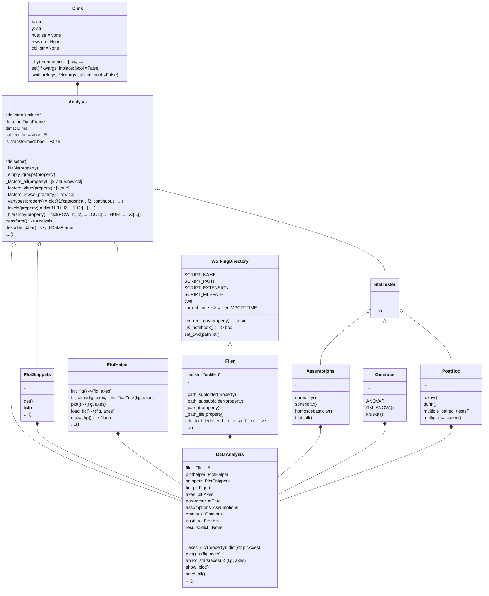

# plotastic

a wrapper for seaborn plotters for convenient statistics powered by pingouin!

## Installation

``` bash
pip install git+https://github.com/markur4/plotastic.git
```

## Why use plotastic?

**Fast**: Make figures and statistics with just a few lines!

**Controllable**: Plotastic outputs common matplotlib figures. We also captures hidden state of matplotlib so that plot is re-usable and modifyable at any point in your notebook/script!

**Easy**: Don't google/remember code, print out pre-built snippets of complex plots and modify them!

**Sturdy**: plotastic doesn't re-invent the wheel: It's combining these packages (maplotlib, seaborn, pingouin, statannotator). It's just a wrapper that makes it easier to use them together.

## 👉 Workflow

1. **🧮 Prepare your pandas DataFrame in a long-format DataFrame**
2. **🔀 Make a DataAnalysis Object `DataAnalysis(DataFrame, x, y, hue, row, col)`**
3. **📊 Plot figure**
4. **✨ Perform statistical tests**

## 👉❗️Statistics Disclaimer

The author is not a dedicated statistician. He derives his knowledge from ...

- ... *Intuitive Biostatistics - Fourth Edition (2017) Harvey MotulskyOxford University Press*
- ... talking to other scientists struggling with statistics

**✅ plotastic can ...**

- ... help you choose correct statistical tests
- ... provide a playground to experiment with plotting and statsistics which can turn into ...
- ... publication grade figures
- ... publication grade statistical analysis **IF** you really know what you're doing OR you have back-checked your results by a professional statistician
- ... quickly test data transformations (log)

**🛑 plotastic can NOT ...**

- ... test for multicolinearity (Absence of multicolinearity is required by ANOVA!)
- ... teach you statistics, you need some basic knowledge
- ... replace a professional statistician

> ### Be **critical** and **responsible** with your statistical analysis
>
> - **Expect Errors:** Don't trust automated systems like this one!
>
> - <b>Document your work in *ridiculous detail*</b>:
>   - ... how technical and biological replicates contributed to your data
>   - ... if/how you removed outliers
>   - ... if you did or did not apply correction methods (multiple comparisons, Greenhouse Geyser, etc.) and what your rationale is (exploratory vs. confirmatory study?, validation through other methods to reduce Type II error?)
>   - Include the applied tests, the number of technical replicates (per datapoint) and the number of biological/independent in each figure legend replicates (per group)
>
> - **Check results with professionnals:**
>   - *"Here is my data, here is my question, here is my analysis, here is my interpretation. What do you think?"*

## 👉 Step by step

### 🧮 Prepare your data in a long-format DataFrame

- `row`, `col` (and `x`) have to be of type `pd.Categorical`!

### 🔀 Initialize `DataAnalysis`

``` python
import seaborn as sns
import plotastic as plst

DF = sns.load_dataset('tips')
DA = plst.DataAnalysis(data = DF, x, y, hue, row, col)
```

**Why is that useful?**

- See how data is organized for each groups
  - group = A sample with a unique combination of `x`, `hue`, `row` and `col`, that shows the technical/biological distribution of a dependent variable `y`. Its samplesize *n* contributes to statistical power.
  - Show levels and n-count for each group
  - Show mean, std, skew, etc. of numerical columns
- Check integrity of data
  - Check samplesize per group
  - Detect empty groups
  - NaN-count per group

### 📊 Plot Data

lorem ipsum dolor

#### Initialize pyplot figure with pre-built function

lorem ipsum dolor

#### Fill axes with seaborn plots

Use pre-built loops

#### Modify figure like any pyplot figure

lorem ipsum dolor

### ✨ Perform Statistics

lorem ipsum dolor

#### Check assumptions

lorem ipsum dolor

#### Omnibus

lorem ipsum dolor

#### Post-Hoc Analysis

lorem ipsum dolor

#### Automated pipelines

- `between_samples(parametric=True)`:    ANOVA + Tukey (✅ Normality, ✅ Homoscedasticity )
- `between_samples(parametric=False)`:  Kruskal-Wallis + Dunn
- `within_samples(parametric=True)`:      RM-ANOVA + multiple paired t-tests (✅ Normality, ✅ Sphericity)
- `within_samples(parametric=False)`:    Friedman + multiple Wilcoxon

lorem

## 👉 Tests that are implemented and work

- Normality (Shapiro-Wilk)
- Sphericity (Levene)

## 👉 Please Cite these papers

- *Vallat, R. (2018). Pingouin: statistics in Python. Journal of Open Source Software, 3(31), 1026. <https://doi.org/10.21105/joss.01026>*
- *Waskom, M. et al. (2021). mwaskom/seaborn: v0.11.1 (January 2021). Zenodo. <http://doi.org/10.5281/zenodo.4547176>*

## 👉 Class Diagram


