# plotastic
### A wrapper for seaborn plotters for convenient statistics powered by pingouin!

## Installation 📦

``` bash
pip install git+https://github.com/markur4/plotastic.git
```

## Why use plotastic? 🤔

**Fast**: Make figures and statistics with just a few lines!

**Controllable**: Plotastic outputs common matplotlib figures. We also captures hidden state of matplotlib so that plot is re-usable and modifyable at any point in your notebook/script!

**Easy**: Don't google/remember code, print out pre-built snippets of complex MultiPlot and modify them!

**Sturdy**: plotastic doesn't re-invent the wheel: It's combining these packages (maplotlib, seaborn, pingouin, statannotator). It's just a wrapper that makes it easier to use them together.

## Workflow ⏳

1. **🧮 Import & Prepare your pandas DataFrame**
2. **🔀 Make a DataAnalysis Object**
   - `DataAnalysis(DataFrame, dims={x, y, hue, row, col})`
3. **📊 Plot figure**
   - Print ready to use matplotlib snippets (kinda like Copilot, but tested!) ... 
   - ... or execute automated functions!
4. **✨ Perform statistical tests** ✨
   - Snippets for better documentation or functions, you choose!
5. **💿 Save all results at once!**


## Statistical Anatomy of a Plotastic Plot 📊

- Every Data is separable into seaborn's `x`, `y`, `hue`, `row`, `col` dimensions
- These dimensions are assigned to statistical terms:
  - `y` is the ***dependent variable*** (***DV***)
  - `x` and `hue` are ***independent variables*** (***IV***) and are treated as ***within/between factors*** (categorical variables)
  - `row` and `col` are ***grouping variables*** (categorical variables)
  - A `subject` may be specified for within/paired study designs (categorical variable)
- For each level of `row` or `col` (or for each combination of `row`- and `col` levels), statistical tests will be performed with regards to the two-factors `x` and `hue`
- Example with ANOVA:
  -  If `x = "day"`, `hue = "gender"`, `row = "smoker"`, `col = "age-group"`, then for each level of `smoker` and `age-group` (e.g. `smoker: "yes"` and `age-group: "young"`), a *two-way ANOVA* will be performed with `day` and `gender` as factors.
  - Three-way ANOVAs are not possible (yet), since that would require setting e.g. `col` as the third factor, or implementing another dimension (e.g. `hue2`).


## Feature List ⚙️

<details>
<summary>⚙️ Feature List (click to unfold) </summary>

### Implemented

- **Plotting:**
  - still refactoring!


### Planned

- **Plotting:**
  - All possible seaborn plote
  - QQ-MultiPlot
- **Assumption testing:**
  - Normality (Shapiro-Wilk)
  - Sphericity (Levene)
- **Omnibus tests:**
  - lorem
  - lorem
- **Post-hoc tests:**
  - lorem
  - lorem


### Maybe..?

- Interactive MultiPlot (where you click stuff and adjust scale etc.)

### Not planned

- Support for seaborn FacetGrid
  - Plotastic uses matplotlib figures and fills its axes with seaborn plot functions. In my opinion, that's the best solution that offers the best adaptibility of every plot detail while bieng easy to maintain
- Support for seaborn objects (same as Facetgrid)

### Not possible

- NOTHING

</details>

## Internal Structure of Plotastic 🌳


<details>


<summary>🌳 Class Diagram (click to unfold) </summary>

### Not everything is implemented. But this is where we're headed. See Features to see what's possible snd what not

```mermaid
classDiagram
   
   class WorkingDirectory{
      <<service>>
      SCRIPT_NAME
      SCRIPT_PATH
      SCRIPT_EXTENSION
      SCRIPT_FILEPATH
      cwd
      current_time: str = filer.IMPORTTIME
      _current_day(property): -> str
      _is_notebook(): -> bool
      set_cwd(path: str)
   }

   class Filer{
      <<service>>
      title: str ="untitled"
      ...
      _path_subfolder(property)
      _path_subsubfolder(property)
      _parent(property)
      _path_file(property)
      add_to_title(to_end:str, to_start:str): -> str
      ....()
   }

   WorkingDirectory <|-- Filer
   Filer *-- DataAnalysis



   %% ANALYSIS #......................................................................................

   class pd_DataFrame{
      ...
      ....()
   }

   class Dims {
      x: str 
      y: str
      hue: str =None
      row: str =None
      col: str =None
      set(**kwargs, inplace: bool =False)
      switch(*keys, **kwargs inplace: bool =False)
   }

   class DimsAndLevels {

      data: pd.DataFrame
      dims: Dims

      title.setter()
      _NaNs(property) 
      %%_empty_groups(property)
      _factors_all(property) [x,y,hue,row,col]
      _factors_xhue(property) [x,hue]
      _factors_rowcol(property) [row,col]
      _vartypes(property) = dict(f1:'categorical', f2:'continuous', ...)
      _levels(property) = dict(f1:[l1, l2, ...], f2:[...], ...)
      ....()
   }
   click DimsAndLevels href "https://github.com/markur4/plotastic/blob/main/plotastic/dimsandlevels.py" "DimsAndLevels.py"
  
   pd_DataFrame *-- DimsAndLevels
   Dims *-- DimsAndLevels




   class DataFrameTool{
      user_levels: dict =None
      subject: str =None
      verbose: bool =False
      catplot(kind="strip") -> sns.FacetGrid
      describe_data() -> pd.DataFrame
      transform() -> Analysis
      categorize() -> pd.DataFrame
      ....()
   }
  click DataFrameTool href "https://github.com/markur4/plotastic/blob/main/plotastic/dataframetool.py" "DimsAndLevels.py"

   DimsAndLevels <|-- DataFrameTool
   DataFrameTool <|-- PlotTool
   %%Analysis <|-- Assumptions
   %%Analysis <|-- Omnibus
   %%Analysis <|-- PostHoc
   DataFrameTool <|-- StatTest

   %% STATISTICS #......................................................................................

   class pingouin{
      <<Statistics Library>>
      anova()
      rm_anova()
      pairwise_tests()
      ....()
   }

   class StatResults{
      <<Storage>>
      normality: pd.DataFrame = "not tested"
      homoscedasticity: pd.DataFrame = "not tested"
      sphericity: pd.DataFrame = "not tested"
      posthoc: pd.DataFrame = "not tested"
      omnibus: pd.DataFrame = "not tested"
      bivariate: pd.DataFrame = "not tested"
      ...
      normal(property):bool ="not assessed"
      homoscedastic(property):bool ="unknown"
      spherical(property):bool ="unknown"
      parametric(property):bool =None
      assess_normality()
      assess_homoscedasticity()
      assess_sphericity()
      ....()
   }

   class StatTest{
      <<BaseObject>>
      ALPHA: float = 0.05
      ALPHA_TOLERANCE: float = 0.075
      results: StatResults 
      ...
      set_alpha()
      set_alpha_tolerance()
      _p_to_stars(p: float) -> str
      _effectsize_to_words(effectsize: float) -> str
      ....()


   }
   StatResults *-- StatTest


   class Assumptions{
      ...
      check_normality()
      check_normality_snip()
      check_sphericity()
      check_sphericity_snip()
      check_homoscedasticity()
      check_homoscedasticity_snip()
      check_all_assumptions()
      check_all_assumptions_snip()
      ....()
   }
   StatTest <|-- Assumptions

   class Omnibus{
      ...
      significant_factors(property): dict
      omni_anova()
      omni_anova_snip()
      omni_rmanova()
      omni_rmamova_snip()
      omni_kruskal()
      omni_kruskal_snip()
      ....()
   }
   class PostHoc{
      ...
      significant_pairs(property): pd.DataFrame
      test_pairwise(paired, parametric)
      ....()
   }
   class Bivariate{
      ...
      test_pearson()
      test_pearson_snip()
      test_spearman()
      test_spearman_snip()
      test_kendall()
      test_kendall_snip()
      ....()
   }

   Assumptions  <|-- PostHoc
   Assumptions  <|-- Omnibus
   Assumptions  <|-- Bivariate
   pingouin .. Assumptions: Uses


   %% PLOTTING #......................................................................................

   class matplotlib{
      <<Plotting Objects>>
      ...
      Axes
      Figure
      fig.legend()
      ....()
   }

   class PlotTool{
      fig: mpl.figure.Figure
      axes: mpl.axes.Axes
      buffer: io.BytesIO
      ...
      subplots() -> (fig, axes)
      fillaxes(kind="strip") -> (fig, axes)
      plot(kind="strip") -> (fig, axes)

      save_plot_tofile() -> None
      save_plot_tobuffer() -> io.BytesIO
      load_plot_frombuffer() -> (fig, axes)


      axes_nested(property) -> np.ndarray(axes).shape(1,1)
      axes_iter__key_ax(property) -> ax

      edit_titles(titles:dict) -> None
      edit_titles_SNIP()
      edit_labels(labels:dict) -> None
      edit_labels_SNIP()
      edit_ticks(ticks:dict) -> None
      edit_ticks_SNIP()
      ....()
   }
   
   matplotlib *-- PlotTool


   class MultiPlot{
      <<Library of pre-built Plots>>
      ...
      plot_box_strip()
      plot_box_strip_SNIP()
      plot_bar_strip()
      plot_bar_strip_SNIP()
      plot_paired_dots()
      plot_paired_dots_SNIP()
      plot_scatter_with_line()
      plot_scatter_with_line_SNIP()
      plot_qqplot()
      ....()
   }

   PlotTool <|-- MultiPlot


   %% DATAANALYSIS #......................................................................................

   class Annotator{
      ...
      check_pairs()
      annotate_pairwise()
   }

   MultiPlot <|-- Annotator
   Omnibus <|-- Annotator
   PostHoc <|-- Annotator
   Bivariate <|-- Annotator

   class DataAnalysis{

      <<Interface>>
      %% FIGURES DON'T NEED TITLES, WE EDIT THEM AFTERWARDS
      title = "untitled" 
      filer: Filer 
      ...
      save_all_tofile()
      save_all_tobuffer()
      load_all_frombuffer()

      annot_stars(axes) -> (fig, axes)

      ....()
   }
   click DataAnalysis href "https://github.com/markur4/plotastic/blob/main/plotastic/dataanalysis.py" "dataanalysis.py"

  Annotator --|> DataAnalysis



```



</details>

<details>

<summary>📈 Pseudo-Flowchart how plotting works (click to unfold) </summary>


</details>

## Disclaimer about Statistics (READ if you're new to statistics)

<details>

<summary>❗️ Disclaimer about Statistics (Click to unfold)</summary>


The author is not a dedicated statistician. He derives his knowledge from ...

- ... *Intuitive Biostatistics - Fourth Edition (2017) Harvey MotulskyOxford University Press*
- ... talking to other scientists struggling with statistics

**✅ plotastic can help you with...**

- ... choosing correct statistical tests
- ... a playground to experiment with plotting and statsistics which can turn into ...
- ... publication grade figures
- ... publication grade statistical analysis **IF** you really know what you're doing OR you have back-checked your results by a professional statistician
- ... quickly test data transformations (log)

**🛑 plotastic can NOT ...**

- ... replace a professional statistician
- ... teach you statistics, you need some basic knowledge (but is awesome for practicing)
- ... test for multicolinearity (Absence of multicolinearity is required by ANOVA!)
- ... perform stringent correction for multiple testing (e.g. bonferoni), as statistical tests are applied to sub-facets of the whole dataframe for each axes, which depends on the definition of x, hue, col, etc. Hence, corrected p-values might over-estimate the significance of your results. 


### Be **critical** and **responsible** with your statistical analysis!


- **Expect Errors:** Don't trust automated systems like this one!
- **Document your work in *ridiculous detail***:
  - ... how technical and biological replicates contributed to your data
  - ... if/how you removed outliers
  - ... if you did or did not apply correction methods (multiple comparisons, Greenhouse Geyser, etc.) and what your rationale is (exploratory vs. confirmatory study?, validation through other methods to reduce Type II error?)
  - Include the applied tests, the number of technical replicates (per datapoint) and the number of biological/independent in each figure legend replicates (per group)>
- **Check results with professionnals:**
  - *"Here is my data, here is my question, here is my analysis, here is my interpretation. What do you think?"*

</details>

## Cite these papers! ✍🏻

- *Vallat, R. (2018). Pingouin: statistics in Python. Journal of Open Source Software, 3(31), 1026. <https://doi.org/10.21105/joss.01026>*
- *Waskom, M. et al. (2021). mwaskom/seaborn: v0.11.1 (January 2021). Zenodo. <http://doi.org/10.5281/zenodo.4547176>*

## Step by step 👈🤞👇👌

### 🧮 Prepare your data in a long-format DataFrame

- `row`, `col` (and `x`) have to be of type `pd.Categorical`!

### 🔀 Initialize `DataAnalysis`

``` python
import seaborn as sns
import plotastic as plst

DF = sns.load_dataset('tips')
DA = plst.DataAnalysis(data = DF, x, y, hue, row, col)
```

**Why is that useful?**

- See how data is organized for each groups
  - group = A sample with a unique combination of `x`, `hue`, `row` and `col`, that shows the technical/biological distribution of a dependent variable `y`. Its samplesize *n* contributes to statistical power.
  - Show levels and n-count for each group
  - Show mean, std, skew, etc. of numerical columns
- Check integrity of data
  - Check samplesize per group
  - Detect empty groups
  - NaN-count per group

### 📊 Plot Data

lorem ipsum dolor

#### Initialize pyplot figure with pre-built function

lorem ipsum dolor

#### Fill axes with seaborn MultiPlot

Use pre-built loops

#### Modify figure like any pyplot figure

lorem ipsum dolor

### ✨ Perform Statistics

lorem ipsum dolor

#### Check assumptions

lorem ipsum dolor

#### Omnibus

lorem ipsum dolor

#### Post-Hoc Analysis

lorem ipsum dolor

#### Automated pipelines

- `between_samples(parametric=True)`:    ANOVA + Tukey (✅ Normality, ✅ Homoscedasticity )
- `between_samples(parametric=False)`:  Kruskal-Wallis + Dunn
- `within_samples(parametric=True)`:      RM-ANOVA + multiple paired t-tests (✅ Normality, ✅ Sphericity)
- `within_samples(parametric=False)`:    Friedman + multiple Wilcoxon

lorem


