<h1 align="center">
  
</h1>

<h1 align="center">

[](https://github.com/psf/black)
[](https://codecov.io/gh/markur4/plotastic)

</h1>

# `plotastic`: Bridging Plotting and Statistics


[//]:<== Installation =========================================================>
# Installation 📦

``` bash
pip install plotastic
# or
pip install git+https://github.com/markur4/plotastic.git
```

[//]:<== Information ==========================================================>
# Information 📚 
*(click to unfold)*

[//]:<------------------------------------------------------------------------->
<details><summary> 🤔<b><i> Why use plotastic?  </i></b> </summary>
<blockquote>
<hr>

#### Statistics made Posssible for EVERYONE:
- Well-known and intuitive parameters used in `seaborn` (***x***,
   ***y***, ***hue***, ***row***, ***col***) are 'translated' into terms
  used for inferential statistics (*between*, *within*, *dv*, etc.) 
  - **-> *If you know how to plot with seaborn, you can apply basic
    statistical analyses!***
- No need need to retype the same arguments of column names into all
  different tests!

#### Optimized Plotting with `matplotlib`:
- Make multi-layered pre-configured plots in just one line!

#### Sturdy:
- plotastic doesn't re-invent the wheel: It's focused on using well
  established classes, functions and libraries (`pd.DataFrame`,
  `plt.subplots`, `sns.catplot`, pingouin, statannotations, etc). It's
  just a wrapper that makes it easier to use them together!
- plotastic provides feedback on how each step of data import,
  transformation, formatting or categorization has affected your table,
  giving beginners the confidence of knowing what they're doing!
  
#### Controllable:
- plotastic outputs common matplotlib figures (`ax`, `fig`). You can
  modify them like any other!
- User keyword arguments are passed through plotastic to `seaborn` and
  `pingouin`, so you can use all their options!


<!-- #### Reviewable:
- We provide snippets that demonstrate of what just happened under the hood, so you can
  backcheck and thoroughly document your work! -->

[//]:<-- end of 🤔 Why use plotastic? ----------------------------------------->
</blockquote>
</details>


[//]:<------------------------------------------------------------------------->
<details><summary> ⏳<b><i> Workflow Summary</b> </i>  </summary>
<blockquote>
<hr>

1. **🧮 Import & Prepare your pandas DataFrame**
   - We require a long-format pandas dataframe with categorical columns
   - If it works with seaborn, it works with plotastic!
2. **🔀 Make a DataAnalysis Object**
   - `DataAnalysis(DataFrame, dims={x, y, hue, row, col})`
   - Check for empty data groups, differing samplesizes, NaN-count, etc.
     automatically
3. **✅ Explore Data**
   - Check Data integrity, unequal samplesizes, empty groups, etc.
   - Quick preliminary plotting with e.g. `DataAnalysis.catplot()`
4. **🔨 Adapt Data**
   - Categorize multiple columns at once
   - Transform dependent variable
   - Each step warns you, if you introduced NaNs without knowledge!
   - etc.
5. **✨ Perform Statistical Tests** ✨
   - Check Normality, Homoscedasticity, Sphericity
   - Perform Omnibus tests (ANOVA, RMANOVA, Kruskal-Wallis, Friedman)
   - Perform PostHoc tests (Tukey, Dunn, Wilcoxon, etc.) based on
     `pg.pairwise_tests()`
6. **📊 Plot figure**
   - Use pre-defined and optimized multi-layered plots with one line
     (e.g. strip over box)!
   - Annotate statistical results (p-values as \*, \*\*, \*\*\*, etc.)
     with full control over which data to include or exclude!
7. **💿 Save all results at once!**
   - One DataAnalysis object holds: 
     - One DataFrame in `self.data`
     - One Figure in `self.fig`, `self.axes`
     - Multiple statistical results: `self.results`
   - Use `DataAnalysis.save_statistics()` to save all results to
     different sheets collected in one .xlsx filesheet per test

[//]:<-- end of ⏳ Workflow Summary -------------------------------------------->
</blockquote>
</details>


[//]:<------------------------------------------------------------------------->
<details><summary> 📊<b><i> Translating Plots into Statistics!</i> </b> </summary>
<blockquote>
<hr>

### In Principle:
- Categorical data is separable into `seaborn`'s categorization
  parameters: ***x***, ***y***, ***hue***, ***row***, ***col***. We call
  those *"dimensions"*.
- These dimensions are assigned to statistical terms:
  - ***y*** is the ***dependent variable*** (***DV***)
  - ***x*** and ***hue*** are ***independent variables*** (***IV***) and
    are treated as ***within/between factors*** (categorical variables)
  - ***row*** and ***col*** are ***grouping variables*** (categorical
    variables)
  - A ***subject*** may be specified for within/paired study designs
    (categorical variable)
- For each level of ***row*** or ***col*** (or for each combination of
  ***row***- and ***col*** levels), statistical tests will be performed
  with regards to the two-factors ***x*** and ***hue***

### Example with ANOVA:
- Imagine this example data: 
  - Each day you measure the tip of a group of people. 
  - For each tip, you note down the ***day***, ***gender***,
    ***age-group*** and whether they ***smoke*** or not. 
  - Hence, this data has 4 categorical dimensions, each with 2 or more
    *levels*:
    - ***day***: 4 levels (*monday*, *tuesday*, *wednesday*, *Thursday*)
    - ***gender***: 2 levels (*male*, *female*)
    - ***smoker***: 2 levels (*yes*, *no*)
    - ***age-group***: 2 levels (*young*, *old*)
- Each category is assigned to a place of a plot, and when calling
  statistical tests, we assign them to statistical terms (in comments):
  - ```python
      # dims is short for dimensions
      dims = dict(          # STATISTICAL TERM:
          y = "tip",        # y-axis, dependent variable
          x = "day",        # x-axis, independent variable (within-subject factor)
          hue = "gender",   # color,  independent variable (within-subject factor)
          col = "smoker",   # axes,   grouping variable
          row = "age-group" # axes,   grouping variable
      )
      ```
- We perform statistical testing groupwise:
  - For each level-combinations of ***smoker*** and ***age-group***, a
    two-way ANOVA will be performed (with ***day*** and ***gender*** as
    ***between*** factors for each datagroup):
    - 1st ANOVA assesses datapoints where ***smoker**=yes* AND
      ***age-group**=young*
    - 2nd ANOVA assesses datapoints where ***smoker**=yes* AND
      ***age-group**=old*
    - 3rd ANOVA assesses datapoints where ***smoker**=no* AND
      ***age-group**=young*
    - 4th ANOVA assesses datapoints where ***smoker**=no* AND
      ***age-group**=old*
  - Three-way ANOVAs are not possible (yet), since that would require
  setting e.g. ***col*** as the third factor, or implementing another
  dimension (e.g. ***hue2***).

[//]:<end of 📊 Translating Plots into Statistics! ---------------------------->
</blockquote>
</details>


[//]:<------------------------------------------------------------------------->
<details><summary> <b>❗️<i> Disclaimer about Statistics </i></b> </summary>
<blockquote>
<hr>

### This software was inspired by ...

- ... ***Intuitive Biostatistics*** - Fourth Edition (2017); Harvey
  Motulsky
- ... ***Introduction to Statistical Learning with applications in
  Python*** - First Edition (2023); Gareth James, Daniela Witten, Trevor
  Hastie, Robert Tibshirani, Jonathan Taylor
- ... talking to other scientists struggling with statistics

#### ✅ `plotastic` can help you with...

- ... gaining some practical experience when learning statistics
- ... quickly gain statistical implications about your data without
  switching to another software
- ... making first steps towards a full statistical analysis
- ... plotting publication grade figures (check statistics results with
  other software)
- ... publication grade statistical analysis **IF** you really know what
  you're doing OR you have back-checked your results by a professional
  statistician
- ... quickly test data transformations (log)

#### 🚫 `plotastic` can NOT ...

- ... replace a professional statistician
- ... teach you statistics, you need some basic knowledge (but is
  awesome for practicing!)
- ... test for multicolinearity (Absence of multicolinearity is required
  by ANOVA!)
- ... perform stringent correction for multiple testing (e.g.
  bonferoni), as statistical tests are applied to sub-facets of the
  whole dataframe for each axes, which depends on the definition of x,
  hue, col, etc. Hence, corrected p-values might over-estimate the
  significance of your results.

#### 🟡 Be **critical** and **responsible** with your statistical analysis!

- **Expect Errors:** Don't trust automated systems like this one!
- **Document your work in *ridiculous detail***:
  - Include the applied tests, the number of technical replicates and
    the number of biological/independent in each figure legend
  - State explicitly what each datapoint represents:
    - 1 datapoint = 1 Technical replicate?  
    - 1 datapoint = The mean of all technical replicate per independent
      replicate/subject?
  - State explicitly what the error-bars mean: Standard deviation?
    Confidence interval?
  - (Don't mix technical with biological/independent variance)
  - Report if/how you removed outliers
  - Report if you did or did not apply correction methods (multiple
    comparisons, Greenhouse Geyser, etc.) and what your rationale is
    (exploratory vs. confirmatory study? Validation through other
    methods to reduce Type I error?)
- **Check results with professionnals:**
  - *"Here is my data, here is my question, here is my analysis, here is
    my interpretation. What do you think?"*

[//]:<end of ❗️ Disclaimer about Statistics------------------------------------>
</blockquote>
</details>


[//]:<== Features =============================================================>
## Features ⚙️


<details><summary>  ✅ <b><i> Feature List </i></b> </summary>
<blockquote>
<hr>

- **✅: Complete and tested**
- **👍: Complete**
- **📆: Planned or unfinished (no date)**
- **🤷: Maybe..? (Rather not...)**
- **🚫: Not planned, don't want**
- **😣: Help Please..?**


[//]:<------------------------------------------------------------------------->
<details open><summary>  <b><i>  Plotting   </i></b> </summary>
<blockquote>

- 👍 Make and Edit Plots: *Implemented ✅*
  - *All (non-facetgrid) seaborn plots should work, not tested*
<!-- - 👍 Printable Code Snippets: *Implemented ✅* -->
- 📆 QQ-Plot
- 📆 Kaplan-Meyer-Plot
- 🤷 Interactive Plots (where you click stuff and adjust scale etc.)
  - *That's gonna be alot of work!*
- 🚫 Support for `seaborn.FacetGrid`
  - *Why not? - `plotastic` uses matplotlib figures and fills its axes
    with seaborn plot functions. In my opinion, that's the best solution
    that offers the best adaptibility of every plot detail while bieng
    easy to maintain*
- 🚫 Support for `seaborn.objects` (same as Facetgrid)
  - *Why not? - I don't see the need to refactor the code*
- 😣 **NEED HELP WITH:** The hidden state of `matplotlib`
  figures/plots/stuff that gets drawn:
  - *I want to save the figure in `DataAnalysis.fig` attribute. As
    simple as that sounds, matplotlib does weird stuff, not applying
    changes after editing the plot.* 
  - *It'd be cool if I could control the changes to a DataAnalysis
    object better (e.g. using `inplace=True` like with `pd.DataFrames`).
    But I never figured out how to control matplotlib figure generation,
    even with re-drawing the figure with canvas. It's a mess and I
    wasted so much time already.*

[//]:<end of Plotting --------------------------------------------------------->
</blockquote>
</details>


[//]:<------------------------------------------------------------------------->
<details open><summary>  <b><i>  Multi-Layered Plotting   </i></b> </summary>
<blockquote>

- ✅ Box-plot + swarm
- 👍 Box-plot + strip
- 📆 Violin + swarm/strip

[//]:<end of Multi-Layered Plotting ------------------------------------------->
</blockquote>
</details>


[//]:<------------------------------------------------------------------------->
<details open><summary>  <b><i>  Statistics   </i></b> </summary>
<blockquote>

- Assumption testing
  - ✅ Normality (e.g. Shapiro-Wilk)
  - ✅ Homoscedasticity (e.g. Levene)
  - ✅ Sphericity (e.g. Mauchly)
- Omnibus tests
  - ✅ ANOVA, RMANOVA, Kruskal-Wallis, Friedman
  - 📆 Mixed ANOVA
  - 📆 Annotate Results into Plot
- PostHoc
  - ✅ `pg.pairwise_tests()`
    - *Works with all primary options. That includes all parametric,
    non-parametric, paired, unpaired, etc. tests (t-test, paired t-test,
    MWU, Wilcoxon, etc.)*
  - ✅ Annotate Stars into plots (\*, \*\*, etc.)
    - *Specific pairs can be included/excluded from annotation*
  - 📆 Make correction for multiple testing go over complete DataFrame
    and not Facet-wise: 
- Bivariate
  - 📆 Find and Implement system to switch between numerical and
    categorical x-axis
    - *Function to convert numerical data into categorical data by
      binning?*
  - 📆 Pearson, Spearman, Kendall

[//]:<end of Statistics ------------------------------------------------------->
</blockquote>
</details>


[//]:<------------------------------------------------------------------------->
<details open><summary>  <b><i>   Analysis Pipelines   </i></b> </summary>
<blockquote>

*Idea: Put all those statistical tests into one line. I might work on
this only after everything's implemented and working confidently and
well!*
- 🤷 `between_samples(parametric=True)`:    ANOVA + Tukey (if Normality
  & Homoscedasticity are given)
- 🤷 `between_samples(parametric=False)`:  Kruskal-Wallis + Dunn
- 🤷 `within_samples(parametric=True)`:      RM-ANOVA + multiple paired
  t-tests (if Normality & Sphericity are given)
- 🤷 `within_samples(parametric=False)`:    Friedman + multiple Wilcoxon

[//]:<end of Analysis Pipelines ----------------------------------------------->
</blockquote>
</details>


[//]:<end of ✅ Feature List ==================================================>
</blockquote> 
</details>


<!-- REMOVE FOR PYPI -->
<!-- REMOVESTART -->
[//]:<=========================================================================>
<details><summary>🌳 <b><i>Class Diagram </b></i> </summary>
<blockquote>
<hr>


- 🛑 Not everything shown here is implemented and not everything that's
  implemented is shown here!
- 🖱️ **Click** on a class to see its source code!

```mermaid
classDiagram
   



   %% == ANALYSIS ==============================================================
   
   class pd_DataFrame{
      ...
      ....()
   }
   class Dims {
      x: str 
      y: str
      hue: str =None
      row: str =None
      col: str =None
      set(**kwargs, inplace: bool =False)
      switch(*keys, **kwargs inplace: bool =False)
   }
   class DimsAndLevels {

      data: pd.DataFrame
      dims: Dims

      title.setter()
      %%_empty_groups(property)
      factors_all(property) [x,y,hue,row,col]
      factors_xhue(property) [x,hue]
      factors_rowcol(property) [row,col]
      levels_dict_factor(property) = dict(f1:[l1, l2, ...], f2:[...], ...)
      levelkeys(property) = [(f1_l1, f2_l1), (f1_l1, f2_l2), ...]
      ....()
   }
   class DataFrameTool{
      levels: list[tuple[str]] =None
      subject: str =None
      verbose: bool =False
      catplot(kind="strip") -> sns.FacetGrid
      transform_y() -> self
      data_describe() -> pd.DataFrame
      data_categorize() -> self
      data_iter__key_facet(property) -> Generator
      ....()
   }

   pd_DataFrame *-- DimsAndLevels
   Dims *-- DimsAndLevels
   DimsAndLevels <|-- DataFrameTool
   DataFrameTool <|-- PlotTool
   DataFrameTool <|-- StatTest


   %% == STATISTICS ============================================================

   class pingouin{
      <<Statistics Library>>
      anova()
      rm_anova()
      pairwise_tests()
      ....()
   }
   class StatResults{
      <<Storage>>
      DF_normality: pd.DataFrame = "not tested"
      DF_homoscedasticity: pd.DataFrame = "not tested"
      DF_sphericity: pd.DataFrame = "not tested"
      DF_posthoc: pd.DataFrame = "not tested"
      DF_omnibus: pd.DataFrame = "not tested"
      DF_bivariate: pd.DataFrame = "not tested"
      ...
      normal(property):bool ="not assessed"
      homoscedastic(property):bool ="unknown"
      spherical(property):bool ="unknown"
      parametric(property):bool =None
      assess_normality()
      save()
      ....()
   }
   class StatTest{
      <<BaseObject>>
      ALPHA: float = 0.05
      ALPHA_TOLERANCE: float = 0.075
      results: StatResults 
      ...
      set_alpha()
      set_alpha_tolerance()
      _p_to_stars(p: float) -> str
      _effectsize_to_words(effectsize: float) -> str
      ....()
   }
   class Assumptions{
      ...
      check_normality()
      check_sphericity()
      check_homoscedasticity()
      ....()
   }
   class Omnibus{
      ...
      omnibus_anova()
      omnibus_rmanova()
      omnibus_kruskal()
      ....()
   }
   class PostHoc{
      ...
      test_pairwise(paired, parametric)
      ....()
   }
   class Bivariate{
      ...
      test_pearson()
      test_spearman()
      test_kendall()
      ....()
   }

   StatResults *-- StatTest
   StatTest <|-- Assumptions

   Assumptions  <|-- PostHoc
   Assumptions  <|-- Omnibus
   Assumptions  <|-- Bivariate
   pingouin .. Assumptions: Uses


   %% == PLOTTING ==============================================================

   class rc{
      <<Runtime Config>>
      FONTSIZE
      STYLE_PAPER
      STYLE_PRESENTATION
      set_style()
      set_palette()
   }
   class matplotlib{
      <<Plotting Objects>>
      ...
      Axes
      Figure
      fig.legend()
      ....()
   }
   class PlotTool{
      fig: mpl.figure.Figure
      axes: mpl.axes.Axes
      ...
      subplots() -> (fig, axes)
      fillaxes(kind="strip") -> (fig, axes)

      axes_nested(property) -> np.ndarray(axes).shape(1,1)
      axes_iter__key_ax(property) -> ax
      
   }
   class PlotEdits{
      edit_titles(titles:dict) -> None
      edit_xy_axis_labels(labels:dict) -> None
      edit_yticklabels_log_minor(ticks:dict) -> None
      ....()
   }
   class MultiPlot{
      <<Library of pre-built Plots>>

      plot_box_strip()
      plot_bar_swarm()
      plot_qqplot()
      ....()
   }

   matplotlib *-- PlotTool
   matplotlib <.. rc: Configures
   PlotTool <|-- PlotEdits
   PlotEdits <|-- MultiPlot


   %% == DATAANALYSIS ==========================================================

   class Annotator{
      _annotated: bool =False
      ...
      _check_include_exclude()
      iter__key_df_ax(PH:pd.DataFrame) -> Generator
      annotate_pairwise()
      ....()
   }
   class Filer{
      <<service>>
      title: str ="untitled"
      prevent_overwrite()
   }
   class DataAnalysis{
      <<Interface>>
      %% FIGURES DON'T NEED TITLES, WE EDIT THEM AFTERWARDS
      title = "untitled" 
      filer: Filer 
      ...
      title_add()
      save_statistics()
      ....()
   }

   MultiPlot <|-- Annotator
   Omnibus <|-- Annotator
   PostHoc <|-- Annotator
   Bivariate <|-- Annotator

   Filer *-- DataAnalysis

   Annotator --|> DataAnalysis


   %% == Links =================================================================

   %% dimensions 
   click Dims href "https://github.com/markur4/plotastic/blob/main/src/plotastic/dimensions/dims.py" 
   click DimsAndLevels href "https://github.com/markur4/plotastic/blob/main/src/plotastic/dimensions/dimsandlevels.py" 
   click DataFrameTool href "https://github.com/markur4/plotastic/blob/main/src/plotastic/dimensions/dataframetool.py" 

   %% stat
   click StatResults href "https://github.com/markur4/plotastic/blob/main/src/plotastic/stat/statresults.py"
   click StatTest href "https://github.com/markur4/plotastic/blob/main/src/plotastic/stat/stattest.py" 
   click Assumptions href "https://github.com/markur4/plotastic/blob/main/src/plotastic/stat/assumptions.py" 
   click Omnibus href "https://github.com/markur4/plotastic/blob/main/src/plotastic/stat/omnibus.py"
   click PostHoc href "https://github.com/markur4/plotastic/blob/main/src/plotastic/stat/posthoc.py"

   %% plotting
   click rc href "https://github.com/markur4/plotastic/blob/main/src/plotastic/plotting/rc.py"
   click PlotTool href "https://github.com/markur4/plotastic/blob/main/src/plotastic/plotting/plottool.py"
   click PlotEdits href "https://github.com/markur4/plotastic/blob/main/src/plotastic/plotting/plotedits.py"
   click MultiPlot href "https://github.com/markur4/plotastic/blob/main/src/plotastic/plotting/multiplot.py"

   %% dataanalysis
   click Annotator href "https://github.com/markur4/plotastic/blob/main/src/plotastic/dataanalysis/annotator.py"
   click Filer href "https://github.com/markur4/plotastic/blob/main/src/plotastic/dataanalysis/filer.py"
   click DataAnalysis href "https://github.com/markur4/plotastic/blob/main/src/plotastic/dataanalysis/dataanalysis.py"



```




[//]:<end of 🌳 Class Diagram =================================================>
</blockquote>
</details>
<!-- REMOVE FOR PYPI -->


[//]:<=========================================================================>
## Cite this! ✍🏻
<details><summary> <i> Please cite the publications of seaborn, pingouin, etc. when using plotastic (click to unfold) </i> </summary>
<blockquote>
<hr>

- *Vallat, R. (2018). Pingouin: statistics in Python. Journal of Open
  Source Software, 3(31), 1026. <https://doi.org/10.21105/joss.01026>*
- *Waskom, M. et al. (2021). mwaskom/seaborn: v0.11.1 (January 2021).
  Zenodo. <http://doi.org/10.5281/zenodo.4547176>*

[//]:<end Cite this! ✍🏻 =======================================================>
</blockquote>
</details>


# Documentation 📔

[//]:<=========================================================================>

## Docs 💡
1. [Quick Example: FMRI Dataset](https://github.com/markur4/plotastic/blob/main/How_To_Use/quick_example_fmri.ipynb)
2. [Switch Dimensions](https://github.com/markur4/plotastic/blob/main/How_To_Use/dimensions.ipynb)
3. [Plotting]((https://github.com/markur4/plotastic/blob/main/How_To_Use/plotting.ipynb))

## Quick Example 💨

[//]:<=========================================================================>
[//]:<.ipynb Notebooks taken from How_To_Use.ipynb>
[//]:<Converted using:>
[//]:<jupyter nbconvert --to markdown your_notebook.ipynb>


### Import plotastic and example Data


```python
import plotastic as plst

# Import Example Data
DF, _dims = plst.load_dataset("fmri", verbose = False)
DF.head()
```

<!-- REMOVE FOR PYPI -->
<!-- REMOVESTART -->

|    | subject   |   timepoint | event   | region   |   signal |
|---:|:----------|------------:|:--------|:---------|---------:|
|  0 |  s7       |           9 | stim    | parietal |    0.059 |
|  1 |  s8       |           9 | stim    | parietal |    0.17  |
|  2 |  s0       |           0 | stim    | frontal  |   -0.021 |
|  3 |  s1       |           0 | stim    | parietal |   -0.064 |
|  4 |  s13      |           9 | stim    | parietal |    0.013 |

<!-- REMOVE FOR PYPI -->

#### Assign each column to a dimension (y, x, hue, col, row):


```python
dims = dict(
    y = "signal",    # y-axis, dependent variable
    x = "timepoint", # x-axis, independent variable & within-subject factor
    hue = "event",   # color,  grouping variable & within-subject factor
    col = "region"   # axes,   grouping variable
)
```

### Initialize DataAnalysis Object
- `DataAnalysis` will give you feedback on data
- The `DataAnalysis` object contains every tool you need, from plotting
  to statistics!


```python
DA = plst.DataAnalysis(
    data=DF,           # Dataframe, long format
    dims=dims,         # Dictionary with y, x, hue, col, row 
    subject="subject", # Datapoints are paired by subject (optional)
    verbose=False,     # Print out info about the Data (optional)
)
```
*prints:*

    ===============================================================================
    #! Checking data integrity...
    ✅ DATA COMPLETE: All combinations of levels from selected factors are present
      in the Dataframe, including x.
    ✅ GROUPS COMPLETE: No groups with NaNs.
    ✅ GROUPS EQUAL: All groups (40 total) have the same samplesize n = 14.0.
    🌳 LEVELS WELL CONNECTED: These Factors have levels that are always found
      together: ['region', 'event'].
      👉 Call .levels_combocount() or .levels_dendrogram() to see them all.
    ===============================================================================


#### Quick Preview Plot:


```python
DA.catplot(alpha=0.3) # Works with *kwargs of seaborn.catplot()
```


    

    


### Perform Statistics

#### Check Normality:


```python
DA.check_normality() # Results not shown here, table too long
```


#### Check Sphericity:


```python
DA.check_sphericity()
```


<!-- REMOVE FOR PYPI -->
<!-- REMOVESTART -->
<sub><sup>
<div>
<table border="1" class="dataframe" style="font-size: 12px;">
  <thead>
    <tr style="text-align: right;">
      <th></th>
      <th></th>
      <th>spher</th>
      <th>W</th>
      <th>chi2</th>
      <th>dof</th>
      <th>pval</th>
      <th>group count</th>
      <th>n per group</th>
    </tr>
    <tr>
      <th>region</th>
      <th>event</th>
      <th></th>
      <th></th>
      <th></th>
      <th></th>
      <th></th>
      <th></th>
      <th></th>
    </tr>
  </thead>
  <tbody>
    <tr>
      <th rowspan="2" valign="top">frontal</th>
      <th>cue</th>
      <td>True</td>
      <td>3.260856e+20</td>
      <td>-462.715239</td>
      <td>44</td>
      <td>1.0</td>
      <td>10</td>
      <td>[14, ...]</td>
    </tr>
    <tr>
      <th>stim</th>
      <td>True</td>
      <td>2.456616e+17</td>
      <td>-392.270460</td>
      <td>44</td>
      <td>1.0</td>
      <td>10</td>
      <td>[14, ...]</td>
    </tr>
    <tr>
      <th rowspan="2" valign="top">parietal</th>
      <th>cue</th>
      <td>True</td>
      <td>1.202935e+20</td>
      <td>-452.946123</td>
      <td>44</td>
      <td>1.0</td>
      <td>10</td>
      <td>[14, ...]</td>
    </tr>
    <tr>
      <th>stim</th>
      <td>True</td>
      <td>2.443175e+13</td>
      <td>-301.989490</td>
      <td>44</td>
      <td>1.0</td>
      <td>10</td>
      <td>[14, ...]</td>
    </tr>
  </tbody>
</table>
</div>
</sup></sub>
<!-- REMOVE FOR PYPI -->


#### Repeated Measures ANOVA:


```python
DA.omnibus_rm_anova()
```

<!-- REMOVE FOR PYPI -->
<!-- REMOVESTART -->
<sub><sup>
<div>
<table border="1" class="dataframe" style="font-size: 12px;">
  <thead>
    <tr style="text-align: right;">
      <th></th>
      <th></th>
      <th>Source</th>
      <th>SS</th>
      <th>ddof1</th>
      <th>ddof2</th>
      <th>MS</th>
      <th>F</th>
      <th>p-unc</th>
      <th>stars</th>
      <th>p-GG-corr</th>
      <th>ng2</th>
      <th>eps</th>
    </tr>
    <tr>
      <th>region</th>
      <th></th>
      <th></th>
      <th></th>
      <th></th>
      <th></th>
      <th></th>
      <th></th>
      <th></th>
      <th></th>
      <th></th>
      <th></th>
      <th></th>
    </tr>
  </thead>
  <tbody>
    <tr>
      <th rowspan="3" valign="top">parietal</th>
      <th>0</th>
      <td>timepoint</td>
      <td>1.583420</td>
      <td>9</td>
      <td>117</td>
      <td>0.175936</td>
      <td>26.205536</td>
      <td>3.402866e-24</td>
      <td>****</td>
      <td>5.834631e-07</td>
      <td>0.542320</td>
      <td>0.222299</td>
    </tr>
    <tr>
      <th>1</th>
      <td>event</td>
      <td>0.770449</td>
      <td>1</td>
      <td>13</td>
      <td>0.770449</td>
      <td>85.316794</td>
      <td>4.483881e-07</td>
      <td>****</td>
      <td>4.483881e-07</td>
      <td>0.365706</td>
      <td>1.000000</td>
    </tr>
    <tr>
      <th>2</th>
      <td>timepoint * event</td>
      <td>0.623532</td>
      <td>9</td>
      <td>117</td>
      <td>0.069281</td>
      <td>29.541730</td>
      <td>3.262477e-26</td>
      <td>****</td>
      <td>3.521208e-06</td>
      <td>0.318157</td>
      <td>0.171882</td>
    </tr>
    <tr>
      <th rowspan="3" valign="top">frontal</th>
      <th>0</th>
      <td>timepoint</td>
      <td>0.686264</td>
      <td>9</td>
      <td>117</td>
      <td>0.076252</td>
      <td>15.988779</td>
      <td>8.285677e-17</td>
      <td>****</td>
      <td>8.940660e-05</td>
      <td>0.394411</td>
      <td>0.190812</td>
    </tr>
    <tr>
      <th>1</th>
      <td>event</td>
      <td>0.240461</td>
      <td>1</td>
      <td>13</td>
      <td>0.240461</td>
      <td>23.441963</td>
      <td>3.218963e-04</td>
      <td>***</td>
      <td>3.218963e-04</td>
      <td>0.185803</td>
      <td>1.000000</td>
    </tr>
    <tr>
      <th>2</th>
      <td>timepoint * event</td>
      <td>0.242941</td>
      <td>9</td>
      <td>117</td>
      <td>0.026993</td>
      <td>13.031063</td>
      <td>3.235739e-14</td>
      <td>****</td>
      <td>1.566020e-04</td>
      <td>0.187360</td>
      <td>0.213142</td>
    </tr>
  </tbody>
</table>
</div>
</sup></sub>
<!-- REMOVE FOR PYPI -->


#### Post-hoc t-tests:


```python
DA.test_pairwise() # Results not shown here, table too long
```


#### Save Results:
Output is one excel file containing results of all performed tests
(normality, anova, t-tests, etc.) in different sheets


```python
DA.save_statistics("example.xlsx")
```

### Plot with Statistical Annotations in Few Lines!


#### OPTIONAL! Use matplotlib styles:


```python
from matplotlib import pyplot as plt
plt.rcdefaults()        # Reset rc to default
plt.style.use('ggplot') # Set styles as you're used to'
```

#### Chain multiple commands for plotting:


```python
(DA
 .plot_box_strip()   # Pre-built plotting function initializes plot
 .annotate_pairwise( # Annotate results from DA.test_pairwise()
     include="__HUE" # Use only significant pairs across each hue
     ) 
)

# Saving the plot requires 
plt.savefig("example.png", dpi=200, bbox_inches="tight")
```


    

    


