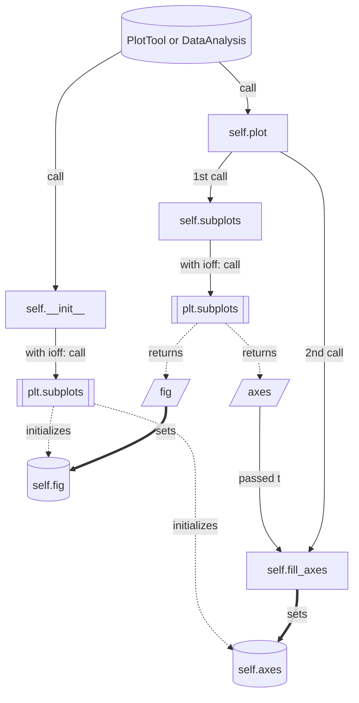

# How plots are made by PlotTool objects

```mermaid

flowchart TD
    PT[(PlotTool or DataAnalysis)]
    self.fig[(self.fig)] 
    self.axes[(self.axes)]
    self.subplots[self.subplots]


    %% INIT PATH
    init[self.__init__]
    plt.subplots[[plt.subplots]] 

    %%ioff[/ioff/]
    %%figax[/fig, axes/]

    PT --call--> init --with ioff: call--> plt.subplots
    plt.subplots -.initializes.-> self.fig & self.axes

    %% SUBPLOTS PATH
    plt.subplots2[[plt.subplots]] 
    %%ioff2[/ioff/]
    %%PT --call--> 
    
    self.subplots --with ioff: call-->plt.subplots2
    plt.subplots2 -.returns.-> fig[/fig/] & axes[/axes/]

    %% PLOT PATH
    self.plot[self.plot]
    self.fill_axes[self.fill_axes]
    %%axes2[/axes/]
    PT --call--> self.plot --1st call--> self.subplots
    axes --passed to--> self.fill_axes
    self.plot --2nd call--> self.fill_axes

    fig ==sets==> self.fig
    self.fill_axes ==sets==> self.axes 


    %%PT --call---> init --call---> s.subplots --call---> p.subplots
    %% p.subplots --fig, axes---> PT


```